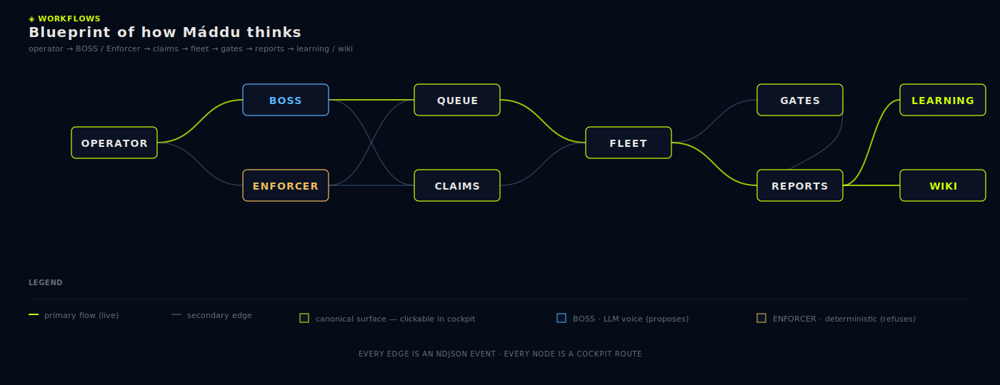

<div align="center">

<picture>
  <source media="(prefers-color-scheme: dark)" srcset="brand/refined/maddu-horizontal-tagline-360x80-dark.svg">
  
</picture>

### *root · origin · ancestry* — North Sámi, pronounced **MOD-doo**

A local-first, files-only framework for orchestrating AI agents inside any git repo.

[](LICENSE)
[](version.json)
[](https://nodejs.org)
[](docs/06-hard-rules.md)
[](docs/06-hard-rules.md)

```bash
npx github:frdyx/maddu init
```

[Get started](docs/01-getting-started.md)  ·  [Five-minute tour](docs/18-first-slice.md)  ·  [Cockpit tour](docs/04-cockpit-tour.md)  ·  [Hard rules](docs/06-hard-rules.md)  ·  [CLI reference](docs/03-cli-reference.md)

</div>

<br/>

<!--
  Demo video — the README references brand/screenshots/cockpit-demo.mp4.
  To produce it, run the Remotion project in marketing/video/:
      cd marketing/video && npm install && npm run render
  The render lands the MP4 at the path below, then this `<video>` block
  plays it inline on the GitHub repo landing page. Until you've rendered
  it, the markdown gracefully shows the workflow blueprint instead.
  See docs/DESIGN-SYSTEM.md and marketing/video/README.md.
-->

<video src="brand/screenshots/cockpit-demo.mp4" controls autoplay loop muted playsinline width="960">
  <source src="brand/screenshots/cockpit-demo.mp4" type="video/mp4">
  <a href="marketing/video/README.md">▶  22-second cockpit demo</a> — run <code>cd marketing/video && npm install && npm run render</code> to produce it.
</video>

<sub align="center"><i>22 seconds. Empty cockpit → first session → lane claim → BOSS proposal → slice-stop with the lime line tracing across. Rendered live from React/CSS via <a href="marketing/video/">Remotion</a>, in lockstep with <a href="docs/DESIGN-SYSTEM.md">the design system</a>. No screenshots, no fakes.</i></sub>

---

## The 30-second pitch

|  | |
|---|---|
| **Local-first** | Máddu runs as a single Node process on your machine. It talks to vendor APIs directly via subprocess workers, with no cloud relay and no telemetry beacon. |
| **Files-only state** | Every fact is an NDJSON event or a JSON projection on disk under `.maddu/`. No SQLite. No embedded DB. No schema migrations. `cat`, `grep`, `git` are the only tools you need to audit it. |
| **Multi-agent native** | Lanes, mailboxes, approvals, hindsight memory, runtime adapters, and a slice-stop ritual are built in — not bolted on. Claude Code and Codex CLI are spawned as workers; Máddu itself imports zero provider SDKs. |

---

## How it looks · how it moves

The 22-second demo above is the cockpit in motion — *live React/CSS, not screenshots*. If your client doesn't play the video inline, here are the two anchors that explain the rest of the visual language:

- **[`docs/DESIGN-SYSTEM.md`](docs/DESIGN-SYSTEM.md)** — the canonical reference for every brand token (canvas, accents, typography), every component anatomy (rail group, KPI tile, palette row, proposal card, inspector tabs, …), the eight motion rules, the three responsive poses, the keyboard contract.

- **The Workflows blueprint** — the cockpit's pure-SVG diagram of how Máddu thinks. Every node is a clickable route, every edge is an event type on the spine:

<br/>

<picture></picture>

<br/>

The video and the design-system doc are kept in lockstep. Tokens live in `template/maddu/cockpit/cockpit.css`, are mirrored to `marketing/video/src/tokens.ts`, and the design-system doc names every one of them. When the cockpit shifts, the doc and the video shift with it.

---

## Why Máddu exists

Most agent-orchestration tools we studied (AionUi, Hermes, OpenClaw and friends) end up reaching for a hidden SQLite database, a hosted gateway, an Electron desktop, or a sprawl of provider SDKs. The result is a stack that's powerful but opaque — you can't `cat` your way to understanding what happened, and you can't move the orchestration off the machine that created it.

Máddu is a deliberate refusal of that pattern. The whole system is a Node process, a static HTML page, and a `.maddu/` directory of plain files. Eight invariants ([`docs/06-hard-rules.md`](docs/06-hard-rules.md)) enforce that refusal. Doctor verifies them on every install and every upgrade.

The Sámi word *máddu* means **root, origin, ancestry** — the spirit-source from which every instance descends. In Máddu the framework, every action, claim, slice, and approval descends from a recorded ancestor on an append-only spine.

> *Máddu spawns no models, stores no secrets, calls no clouds.*

---

## What you get after `maddu init`

```
your-repo/
├─ .maddu/                     ← state directory (committed)
│  ├─ events/000000000001.ndjson     append-only spine
│  ├─ state/projection.json          rebuildable JSON projections
│  ├─ sessions/                      registered agent sessions
│  ├─ lanes/catalog.json             scoped work areas + ownership
│  ├─ inbox/current-session.md       append-only operator inbox
│  ├─ skills/                        SKILL.md-pattern recipes
│  ├─ memory/                        hindsight-extracted facts
│  └─ harness/                       node-only harness scripts
├─ maddu/                      ← runtime + cockpit (committed)
│  ├─ runtime/server.js              the bridge (127.0.0.1:4177)
│  └─ cockpit/index.html             the single-page app
└─ maddu.json                  ← framework version + install metadata
```

Nothing else in your repo is touched. `.gitignore` gets one stanza added for OS auth paths only.

---

## The cockpit

A single-page web app on `http://127.0.0.1:4177`. **27 routes** grouped into five phase-of-work clusters in the left rail — `DECIDE → OPERATE → VERIFY → CONNECT → REFERENCE`. The rail shrinks to glyph-only on tablets and becomes a bottom dock on mobile. Press `?` from anywhere to open the in-cockpit docs. Press `Ctrl + K` to jump anywhere.

<table width="100%">
<tr><th align="left" colspan="2">◆ DECIDE  <sub><i>what is safe to do next</i></sub></th></tr>
<tr><td width="22%"><code>/conductor</code> ◆</td><td>KPI strip, next-command, score matrix, Now/Next/Waiting/Done board.</td></tr>
<tr><td><code>/boss</code> ◆</td><td>BOSS proposes · Enforcer cites · operator decides. Action-proposal cards with risk pill.</td></tr>
<tr><td><code>/queue</code></td><td>Scheduler / Queue / Dispatch / Preflights kanban with reason codes.</td></tr>
<tr><td><code>/claims</code></td><td>Active claims by lane with lease state, heartbeat age, handoff button.</td></tr>
<tr><td><code>/approvals</code></td><td>Pending permission requests + decision ledger + standing policies.</td></tr>
<tr><td><code>/tasks</code></td><td>Dependency-aware task board with auto-unblocking.</td></tr>

<tr><th align="left" colspan="2">◈ OPERATE  <sub><i>agents, lanes, conversations</i></sub></th></tr>
<tr><td><code>/workflows</code> ◆</td><td>Pure-SVG blueprint of the framework as a system. Every node opens its route.</td></tr>
<tr><td><code>/agents</code></td><td>Coworker profile grid — role, focus, claims held, score, heartbeat, last slice.</td></tr>
<tr><td><code>/teams</code></td><td>Lane ownership map with held/free pills + policy strip.</td></tr>
<tr><td><code>/workbench</code></td><td>OS-style three-pane shell. Lanes + sessions · live stream · status counts.</td></tr>
<tr><td><code>/chats</code></td><td>Conversation surfaces with history + replay.</td></tr>
<tr><td><code>/mailbox</code></td><td>Per-lane mailbox bus for async cross-lane handoffs.</td></tr>
<tr><td><code>/swarm</code></td><td>Lane roster, worker status donut, claim resolution.</td></tr>

<tr><th align="left" colspan="2">⌬ VERIFY  <sub><i>evidence, memory, wiki</i></sub></th></tr>
<tr><td><code>/learning</code> ◆</td><td>Hindsight memory — facts distilled from slice-stops. Filter by kind / lane / query.</td></tr>
<tr><td><code>/wiki</code> ◆</td><td>Auto-maintained per-lane wiki. Drift drawer flags pages that fell behind the spine.</td></tr>
<tr><td><code>/events</code></td><td>Long-poll cursor over the spine, filterable by type. Pause/resume.</td></tr>
<tr><td><code>/operations</code></td><td>Slice-stop ledger, hindsight memory, checkpoint timeline.</td></tr>
<tr><td><code>/search</code></td><td>Cross-corpus search — events, slice-stops, memory, skills, mailbox, inbox.</td></tr>

<tr><th align="left" colspan="2">⌗ CONNECT  <sub><i>runtimes, auth, integrations</i></sub></th></tr>
<tr><td><code>/runtimes</code></td><td>Pluggable subprocess adapters — Claude Code, Codex, future agents.</td></tr>
<tr><td><code>/mcp</code></td><td>Bridge-owned MCP server registry. stdio / sse / http.</td></tr>
<tr><td><code>/auth</code></td><td>Multi-key OAuth store with rotation. Tokens never leave the device.</td></tr>
<tr><td><code>/imports</code></td><td>Foreign-artifact gateway with secret-shape rejection.</td></tr>
<tr><td><code>/schedule</code></td><td>Natural-language → cron. Bridge polls every 30 s.</td></tr>
<tr><td><code>/settings</code></td><td>Bridge, lanes, providers, Telegram / Discord / Email bridges, MCP, paths, hard rules.</td></tr>

<tr><th align="left" colspan="2">☷ REFERENCE  <sub><i>dashboard, docs, roadmap</i></sub></th></tr>
<tr><td><code>/dashboard</code></td><td>At-a-glance status. Donut pair, sparklines, capacity meters.</td></tr>
<tr><td><code>/roadmap</code></td><td>Roadmap KPIs, 28-day closure cadence, lane mix, clickable slice index.</td></tr>
<tr><td><code>/skills</code></td><td>Reusable agent recipes distilled from slice-stops (`SKILL.md` format).</td></tr>
<tr><td><code>/docs</code></td><td>Full end-user manual, anchor-deep-linkable, with backlinks.</td></tr>
</table>

Every route renders summary widgets via a **pure-SVG widget kit** (no chart library, per [hard rule #4](docs/06-hard-rules.md)). Routes marked ◆ are *anchor* routes — the five depth-upgrade signatures that every other surface plugs into.

---

## The eight hard rules

| # | Rule | Why |
|---|---|---|
| 1 | **Files-only state** | Auditability with `cat`. Backup with `cp`. Portability with `git`. Recovery without specialized tooling. |
| 2 | **Append-only event spine** | Single home for truth. Every state question reduces to "replay the spine." |
| 3 | **No hosted backends** | Local-first means local-first. No relay, no telemetry, no "Máddu Cloud." |
| 4 | **No broad dependencies** | Supply-chain integrity. Reproducibility. No surprise transitive vulnerabilities. |
| 5 | **No provider SDKs in app code** | The cockpit is a UI for orchestration, not a model client. Keeps SDKs out of the bridge surface. |
| 6 | **No token export** | OAuth tokens are device credentials, not portable identity. |
| 7 | **Three-layer brand boundary** | Framework shell brand / app brand / content brand never bleed into each other. |
| 8 | **Lane ownership** | Multi-agent work without conflict requires an explicit coordination primitive. Lanes + mailboxes are it. |

`maddu doctor` verifies all eight on every install. Full text: [`docs/06-hard-rules.md`](docs/06-hard-rules.md).

---

## Quick start

```bash
# 1.  Install into the current repo
$ npx github:frdyx/maddu init
✓ .maddu/ skeleton created
✓ maddu/ runtime + cockpit installed
✓ maddu.json written  (framework 0.12.0)

# 2.  Verify install integrity + hard-rule compliance
$ maddu doctor
✓ files-only state
✓ append-only spine
✓ no provider SDKs in app code
✓ port 4177 available
8/8 checks pass

# 3.  Boot the bridge
$ maddu start
Máddu  v0.12.0  ·  http://127.0.0.1:4177  ·  pid 84711

# 4.  Open the cockpit in your browser
$ open http://127.0.0.1:4177

# 5.  Register a session, claim a lane, ship a slice
$ maddu session register --runtime claude-code --lane cockpit-shell \
    --label "Claude — restyle settings page"  \
    --focus "ship lane defaults editor"
session_id  s-2026-05-15-a1b2

# 6.  When done, run the slice-stop ritual
$ maddu slice-stop "SLICE STOP: settings-editor  …"
```

---

## CLI

```
maddu init           Install into the current directory.
maddu upgrade        Pull newer framework files in place; never touch project state.
maddu doctor         Verify install integrity, port availability, hard-rule compliance.
maddu start          Boot the bridge server on 127.0.0.1:4177.
maddu status         Print a state snapshot.
maddu slice-stop     Run the slice-stop ritual at the end of a working session.
maddu session        register / heartbeat / close / list.
maddu lane           claim / release / list.
maddu approval       list / respond / policy.
maddu auth           add / list / remove / rate-limit.
maddu skill          create / from-slice / list / show / apply.
maddu memory         search / extract.
maddu mailbox        send / read / list.
maddu task           create / update / done / list.
maddu worker         spawn / heartbeat / exit / kill / list.
maddu runtime        register / detect / spawn / list.
maddu mcp            register / enable / disable / test / list.
maddu schedule       create / enable / disable / list.
maddu checkpoint     create / rollback / list.
maddu import         submit / scan / list.
maddu events         append / poll / wait.
maddu search         <query>.
```

Full reference with flags + examples: [`docs/03-cli-reference.md`](docs/03-cli-reference.md).

---

## Architecture in one diagram

```
                ┌──────────────────────────────────────────┐
                │   .maddu/events/*.ndjson                 │
                │   append-only spine — single source      │
                │   of truth, the actual máddu             │
                └────────────────┬─────────────────────────┘
                                 │ replay
                                 ▼
                ┌──────────────────────────────────────────┐
                │   .maddu/state/*.json                    │
                │   projections — rebuildable, never       │
                │   authoritative; the spine wins          │
                └────────────────┬─────────────────────────┘
                                 │ read
                                 ▼
   ┌──────────────────┐  HTTP   ┌────────────────────┐   spawn   ┌──────────────────┐
   │  Bridge (Node)   │◀───────▶│   Cockpit (SPA)    │           │ Workers          │
   │  127.0.0.1:4177  │         │   /dashboard       │           │ claude exec      │
   │                  │         │   /workbench       │           │ codex exec       │
   │                  │         │   /approvals …     │           │ future runtimes  │
   └────────┬─────────┘         └────────────────────┘           └────────┬─────────┘
            │                                                             │
            │              credentials injected at spawn                  │
            └─────────────────────────────────────────────────────────────┘
                              (workers own provider APIs;
                               bridge imports zero SDKs)
```

Deep dive: [`docs/15-architecture.md`](docs/15-architecture.md).

---

## Documentation

**Start here** — [`docs/00-index.md`](docs/00-index.md) — table of contents + 60-second overview.

| Getting started | Concepts | Reference | Advanced |
|---|---|---|---|
| [Installation](docs/installation.md) | [Concepts](docs/02-concepts.md) | [CLI](docs/03-cli-reference.md) | [Architecture](docs/15-architecture.md) |
| [Getting started](docs/01-getting-started.md) | [Lanes & sessions](docs/07-lanes-and-sessions.md) | [Bridge endpoints](docs/05-bridge-endpoints.md) | [Widget kit](docs/16-widget-kit.md) |
| [Five-minute tour](docs/18-first-slice.md) | [Slice-stop ritual](docs/08-slice-stop-ritual.md) | [Hard rules](docs/06-hard-rules.md) | [Upgrade policy](docs/upgrade-policy.md) |
| [Cockpit tour](docs/04-cockpit-tour.md) | [Approvals & permissions](docs/09-approvals-and-permissions.md) | [Lanes](docs/lanes.md) | [Auth & imports](docs/12-auth-and-imports.md) |
| [Troubleshooting](docs/13-troubleshooting.md) | [Skills & hindsight](docs/10-skills-and-hindsight.md) | [Validation checklist](docs/17-validation-checklist.md) | [Runtimes & MCP](docs/11-runtimes-and-mcp.md) |
|  |  | [Design system](docs/DESIGN-SYSTEM.md) | [Marketing video](marketing/video/README.md) |
|  |  | [Changelog](CHANGELOG.md) |  |

---

## Roadmap status

**v0.3.x — original synthesis roadmap** *(complete)*

- ✓ **Phase A — Foundations.** `/approvals` ledger, `/events/live` cursor stream, hindsight extraction worker.
- ✓ **Phase B — Operator productivity.** Slash-command composer, mailbox bus, dependency-aware tasks, skills gallery, heartbeat watcher, cross-corpus search.
- ✓ **Phase C — Power user.** Runtime adapter contract, MCP visual registry, NL→cron scheduler, checkpoint timeline, multi-key rotation.
- ◻ **Phase D — Vision.** `/workbench` shell ✓, `/imports` gateway ✓, office-artifact preview pane (deferred).

**v0.4–v0.8 — depth-upgrade plan** *(complete)*

- ✓ **Slice α** — Conductor + Inspector (`v0.4.0`)
- ✓ **Slice β** — Queue Board + Claim Map (`v0.5.0`)
- ✓ **Slice γ** — BOSS / Enforcer duality (`v0.6.0`)
- ✓ **Slice δ** — Learning Memory + Wiki Updater (`v0.7.0`)
- ✓ **Slice ε** — Workflows + Roadmap depth + Agents + Teams (`v0.8.0`)

**v0.9–v0.10 — optional integrations** *(off by default, allowlisted)*

- ✓ **Slice ζ** — Telegram bridge (long-poll, no public webhook) (`v0.9.0`)
- ✓ **Slice η** — Discord + Email outbound-only bridges (`v0.10.0`)

**v0.11–v0.12 — cockpit polish + sub-target system** *(complete)*

- ✓ Grouped rail (5 phase-of-work clusters), tablet-collapse, mobile dock
- ✓ `Ctrl+K` command palette with route / sub-target / action results
- ✓ Inspector responsive: persistent → slide-over → bottom-sheet
- ✓ Signature motion: 900 ms lime line on every `SLICE_STOP`
- ✓ Design-system alignment for scrollbars, buttons, inputs, focus rings
- ✓ Sub-target programmatic registry — every searchable entity in the
  cockpit reachable by typing its own name (`Ctrl+K` → "anthropic",
  "telegram", "<session-label>", any lane name, any open task title…)
- ✓ Shape-aware skeleton bones (`loadingFor`) so panels don't reflow

**Next**

- ◻ `v1.0.0` — gated on the validation walkthrough at
  [`docs/17-validation-checklist.md`](docs/17-validation-checklist.md).
  Real-world Telegram/Discord/Email smoke + the lime-line motion check.

Full per-version notes: [`CHANGELOG.md`](CHANGELOG.md). Original
synthesis detail: [`docs/maddu-v0.3-roadmap.md`](docs/maddu-v0.3-roadmap.md).

---

## FAQ

<details>
<summary><strong>Why not SQLite?</strong></summary>

SQLite is excellent — and wrong for this project's thesis. The thesis is that orchestration state should remain auditable with `cat`, diffable with `git`, and recoverable without specialized tooling. SQLite breaks all three. Prior systems we studied lost slice context to corrupt rows that no operator noticed for a week; the append-only NDJSON spine makes that failure mode impossible.

</details>

<details>
<summary><strong>Does it work offline?</strong></summary>

The bridge + cockpit + spine + projections all run offline. Provider calls (Claude, Codex, future runtimes) require network because that's where the models live — but Máddu itself spawns no models. You can run the bridge, register sessions, run slice-stops, and inspect history with no internet at all.

</details>

<details>
<summary><strong>Can I use it with my own LLM runtime?</strong></summary>

Yes. Register it under `/runtimes` with a binary path, detection command, and capability descriptor. The bridge will spawn it like any other worker. The runtime adapter contract is one JSON schema; see [`docs/11-runtimes-and-mcp.md`](docs/11-runtimes-and-mcp.md).

</details>

<details>
<summary><strong>Is the cockpit a desktop app?</strong></summary>

No. It's a static HTML page served by the Node bridge. Open it in any browser. No Electron, no native window, no installer beyond `npx github:frdyx/maddu init`.

</details>

<details>
<summary><strong>Where do OAuth tokens live?</strong></summary>

- Linux/macOS: `~/.config/maddu/auth/`
- Windows: `%APPDATA%\maddu\auth\`

The bridge never returns raw token values over HTTP; the cockpit only ever sees label + last-4 chars. `maddu export` scrubs tokens from portable bundles. `maddu import` refuses to overwrite existing tokens.

</details>

<details>
<summary><strong>How is it different from AionUi, Hermes, OpenClaw?</strong></summary>

Those systems gave us most of the ideas (lanes, mailboxes, approvals, hindsight memory, runtime adapters). Máddu re-implements them under a stricter set of invariants — no SQLite, no Electron, no provider SDKs in app code, no hosted relay, no token export. The 11 patterns those systems use that Máddu explicitly refuses are catalogued in the [do-not-copy table](docs/06-hard-rules.md).

</details>

<details>
<summary><strong>Why a Sámi name?</strong></summary>

Because *máddu* captures what the framework actually does — it anchors every action to a recorded ancestor — in a way no English word does. And because Anglo-Saxon naming defaults in software are not a law of nature.

</details>

---

## Project ethos

> *Máddu spawns no models, stores no secrets, calls no clouds.*

The framework is a witness, not an actor. It records what happens; it does not perform. Its job is to be the floor you stand on while AI workers do the work above it — and to be the floor that survives them when they're gone.

**License:** Apache-2.0. See [`LICENSE`](LICENSE).

**Contributing:** issues and PRs welcome. The framework is pre-1.0; expect tag-boundary changes. Slice-stops are how we record decisions — if you contribute a non-trivial change, run `maddu slice-stop` and include the summary in the PR description.

**Brand assets:** [`brand/README.md`](brand/README.md). The mark is Spine Seal — a sealed lozenge segmented by two angular cuts; reads as seal, spine, and root in one primitive.
