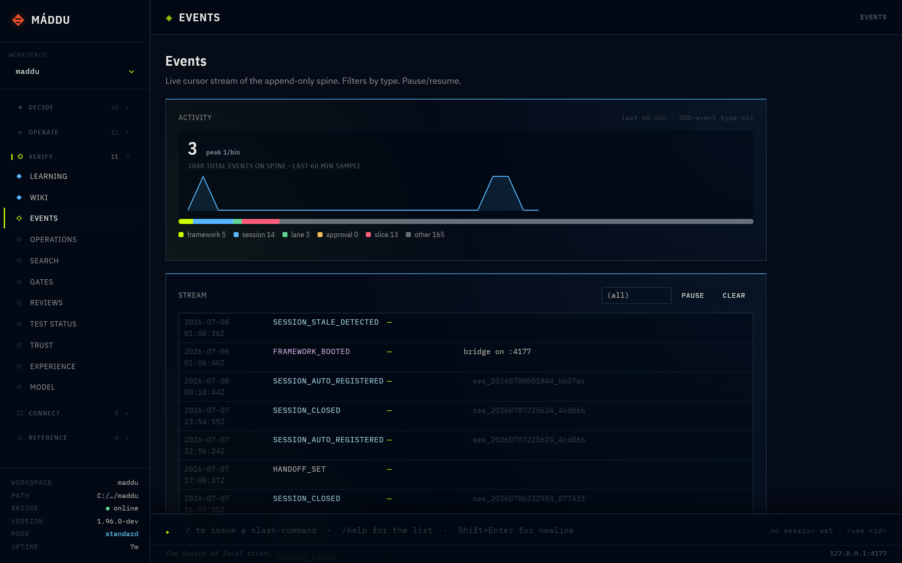
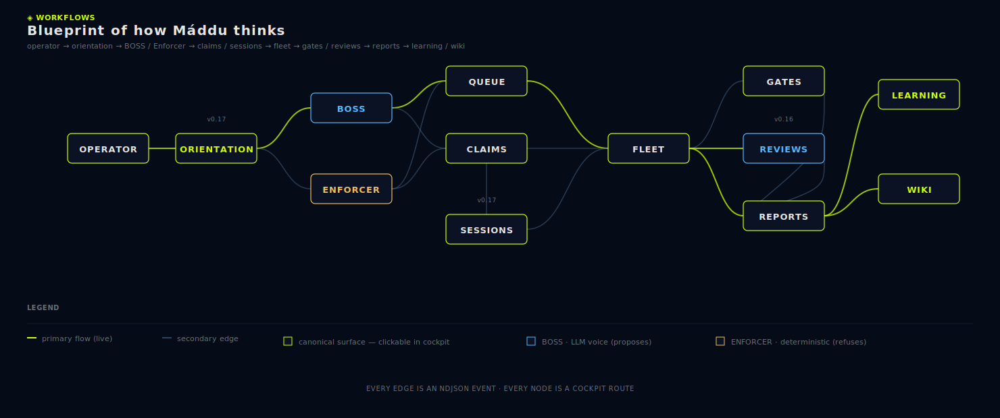

<div align="center">

<picture></picture>

# Máddu

**Máddu is a local-first orchestration spine for AI agents.** A small Node process puts every approval, session, and slice of work onto an append-only event log on disk — and a static-page cockpit lets you watch and replay it in any browser.

Built for developers running Claude Code, Codex, or other AI agent CLIs from the terminal — anyone who wants their orchestrator to outlive every agent that touches it. No SQLite. No cloud relay. No provider SDKs in your code. The spine replays deterministically on any machine, so every state question reduces to `tail` on a file.

[](version.json)
[](https://nodejs.org)
[](LICENSE)

```bash
npx github:frdyx/maddu init
```

> *Máddu spawns no models, stores no secrets, calls no clouds.*

[Quickstart](docs/01-getting-started.md) · [Hard rules](docs/hard-rules.md) · [Slash commands](docs/22-slash-commands.md)

</div>

---

## Zero learning curve (v0.18)

Inside Claude Code or Codex CLI, type a slash command — or just
natural language. Máddu picks the right action and tells you which
one. The verbose CLI stays first-class for scripts and CI.

| Slash command | What it does |
|---|---|
| `/maddu-autopilot <task>` | End-to-end: register → suggest lane → claim → plan-exec-verify-fix → slice-stop. |
| `/maddu-plan <topic>` | Plan-only stage; writes a brief artifact. |
| `/maddu-review [slice-id]` | Post-stop review of a slice. |
| `/maddu-team <N> <task>` | Open N child sessions with disjoint lanes. |
| `/maddu-advise <runtime> <prompt>` | Non-claiming advisor query; artifact-only. |
| `/maddu-status` | Pretty-print state across surfaces. |
| `/maddu-cost` | Token / call rollup per session, day, runtime, model. |
| `/maddu-skill <verb>` | List / search / apply skills. |
| `/maddu-help` | Discovery guide for every slash command. |
| `/maddu-doctor` | Run hard-rule gates and surface findings. |
| `/maddu-cancel` | Stop the current slice cleanly. |
| `/maddu-note <text>` | One-liner into the operator inbox. |

Or just type *"ship the login form"*, *"status"*, *"tokens"*. The
agent classifies the intent from `MADDU.md` and dispatches the
matching slash command. Full reference:
[22-slash-commands.md](docs/22-slash-commands.md) +
[23-natural-language-routing.md](docs/23-natural-language-routing.md).

---

## 60-second tour

```bash
$ npx github:frdyx/maddu init
✓ Máddu v0.18.0 installed.

$ ./maddu/run start &
Máddu  v0.17.0  ·  http://127.0.0.1:4177  ·  ready

$ ./maddu/run register
ses_20260518081409_b7f312
(active session cached — idempotent on MADDU_SESSION_ID)

$ ./maddu/run slice-stop --summary "wired the bridge to my repo"
SLICE_STOP appended  evt_20260518084211_a1b2c6

$ tail -n 1 .maddu/events/000000000001.ndjson
{"v":1,"id":"evt_20260518084211_a1b2c6","type":"SLICE_STOP","actor":"ses_20260518081409_b7f312","data":{"summary":"wired the bridge to my repo"}}
```

Every state question reduces to `tail` on a file. That's the whole product.

Full walkthrough → [docs/01-getting-started.md](docs/01-getting-started.md).

## How it thinks

The bridge is one Node process bound to `127.0.0.1:4177`. The spine is `.maddu/events/*.ndjson` — append-only, single source of truth, the only thing on disk that gets to be authoritative. Everything under `.maddu/state/` is a projection: rebuildable from the spine, discarded on conflict. The cockpit is a static HTML+JS page the bridge serves over loopback. Subprocess workers (Claude Code, Codex, future runtimes) are spawned with credentials handed in at spawn-time; the bridge imports zero provider SDKs. Files-only state. The spine wins over any projection.

<a href="docs/images/spine-and-event-flow.svg"><picture></picture></a>

<!--
  TODO(post-screenshot): when docs/images/cockpit-hero.png lands, uncomment
  this <picture> tag and remove this comment block. It shows the running
  cockpit at /conductor with a sample slice-stop visible.

  <picture></picture>
-->

<a href="docs/images/workflows-blueprint.svg"><picture></picture></a>

*Every edge is an ndjson event · every node is a cockpit route.*

```jsonl
{"v":1,"id":"evt_20260518081402_a1b2c3","ts":"2026-05-18T08:14:02.117Z","type":"FRAMEWORK_INSTALLED","actor":null,"lane":null,"data":{"version":"0.16.0"}}
{"v":1,"id":"evt_20260518081409_a1b2c4","ts":"2026-05-18T08:14:09.482Z","type":"SESSION_REGISTERED","actor":"ses_20260518081409_b7f312","lane":null,"data":{"role":"implementer","label":"first slice","runtime":"claude-code"}}
{"v":1,"id":"evt_20260518081733_a1b2c5","ts":"2026-05-18T08:17:33.904Z","type":"APPROVAL_DECIDED","actor":"policy","lane":null,"data":{"approvalId":"evt_20260518081728_d3e4f5","decision":"deny","reason":"policy:bash@*","tool":"bash"},"triggered_by":{"kind":"policy","id":"bash@*","fired_at":"2026-05-18T08:17:33.901Z"}}
{"v":1,"id":"evt_20260518084211_a1b2c6","ts":"2026-05-18T08:42:11.006Z","type":"SLICE_STOP","actor":"ses_20260518081409_b7f312","lane":null,"data":{"summary":"wired the bridge to my repo"}}
```

*Every event you'll ever debug is one line in this file.*

## Why Máddu

Six design choices, and what each one lets you do that you couldn't before.

**Audit with `cat`.**

Every approval, session boundary, and slice-stop lands as one line in one file.

`.maddu/events/*.ndjson` is the append-only spine; every state question reduces to `tail` on a file, or `grep`, or `git log`.

You introspect the system with shell tools you already trust — no SQLite to crack open, no log aggregator to provision, no dashboard between you and the truth.

**Survive a projector rebuild.**

Delete `.maddu/state/`, rebuild from the spine on any machine, and get the exact same ledger.

Decisions live as real events, never as projector-derived state: per-repo and global approval policies emit a real `APPROVAL_DECIDED` event with a top-level `triggered_by` field (`kind: "policy" | "global_policy"`, `id`, `fired_at`).

The spine wins over any projection — audit immutability is operator-provable, not declared in a doc.

**Operator-verifiable bedrock.**

Spine corruption surfaces immediately, by name, with file and line precision.

`maddu spine verify` walks every NDJSON segment and checks parseability, event-id uniqueness, segment continuity, timestamp monotonicity, and referential integrity across eight event-type relationships; `maddu doctor` runs the same check on every invocation up to a 50k event cap.

No `maddu spine repair` exists by design — the operator reads the failure and decides remediation. Verifiable, not just declared.

**One bridge, every repo.**

Switch context across five repos without booting five bridges.

`maddu workspace add` registers a repo in `~/.config/maddu/workspaces.json`; one bridge mounts every workspace at boot, the `X-Maddu-Workspace` header (or the registry's `active` field) routes per-request, and `/bridge/_all/*` fans out reads across all mounts with each row tagged by workspace.

Each repo's spine stays its own source of truth while the cockpit gives you the aggregated view.

**Slice-stops are the only path into memory.**

Nothing enters long-term memory without a structured event saying so.

Every working slice ends with a `SLICE_STOP` event; the hindsight extractor reads only `SLICE_STOP` events, and this is the only way new facts reach `.maddu/state/memory.ndjson` or skills land in `.maddu/skills/`.

Derived ≠ projected: memory is exactly what slice-stops produced, which means it stays auditable, replayable, and deletable.

**Zero provider SDKs, zero cloud relay.**

SDK churn from Anthropic, OpenAI, or Google never reaches your orchestrator.

The bridge and cockpit import nothing from `anthropic`, `openai`, or `@google/generative-ai`; provider calls happen only inside spawned subprocess workers (Claude Code, Codex, future runtimes) with credentials injected at spawn, tokens stay device-bound at `~/.config/maddu/auth/`, and `maddu export` scrubs them on the way out.

Máddu spawns no models, stores no secrets, calls no clouds — supply-chain integrity holds, and your credentials never traverse a remote service.

## Agent-native bootstrap · v0.17

*Closes the loop opened by v0.16: every governance surface is contingent on agents being participants in the spine. v0.16 built the surfaces; v0.17 puts the agents on the spine **by default**.*

**One canonical brief at repo root.** `maddu init` drops `MADDU.md` (the full agent contract), plus marker-delimited stanzas in `CLAUDE.md` and `AGENTS.md` that point at it. Marker discipline (`<!-- BEGIN MADDU v1 -->` / `<!-- END MADDU v1 -->`) means project content outside the markers is never touched. Any LLM CLI reading a root-level agent file learns Máddu on first turn.

**Zero-keystroke session register.** `maddu register` (vs. the longer `session register --role … --label … --focus …`). Idempotent: re-running in the same shell with `MADDU_SESSION_ID` set returns the cached id instead of duplicating. The agent's mandatory first command of every turn.

**Tree provenance for fan-out.** A parent terminal that spawns N sub-agents now produces N distinct sessions, each linking back via `parentSessionId`. `maddu session tree` shows the tree; the cockpit's Orientation route renders it live. Runtime descriptors gain `autoRegister: true` — the bridge registers a fresh child session per `spawnWorker` call.

**Self-cleaning sessions.** A stale-session janitor runs inline on every `/bridge/projection` read (no daemon, no new timer thread). Default 30 min stale → `SESSION_STALE_DETECTED`; 4 hr → `SESSION_AUTO_CLOSED` (allowlisted-mutating per candidate rule #9). Thresholds configurable via `.maddu/config/janitor.json`.

**Agents read their context with one command.** `maddu brief --for-agent` (text) and `GET /bridge/agent-context` (JSON) return everything an agent needs to bootstrap: goal, phase, active session, open follow-ups, lane catalog, recent slice-stops, three first-commands. `MADDU.md` tells agents to call this at every turn start.

**Sessions panel in the cockpit.** `#orientation` now shows the live session tree alongside goal/phase/follow-ups. Stale-session count surfaces in the same view. Janitor activity is visible.

Full reference → [docs/21-agent-onboarding.md](docs/21-agent-onboarding.md). What changes when you upgrade → [CHANGELOG v0.17.0](CHANGELOG.md).

## The governance layer · v0.16

*Six opt-in surfaces an agent picks up over the substrate above. A repo that ignores `.maddu/config/` and `.maddu/gates/` behaves exactly as v0.15 — adoption is per-feature, none of it mandatory.*

**Turn-start orientation.** `maddu brief` prints goal, phase, active session, last slice-stop, counters, open follow-ups, plus the rendered handoff from the most recent slice — and writes deterministic projections to `.maddu/state/orientation.json` + `.maddu/state/handoff.md`. Same spine in, same bytes out. Set goal/phase with `maddu goal set` / `maddu phase set`.

**Extensible gate runner.** `maddu doctor` is now a fan-out runner over framework-shipped built-in gates plus operator gates dropped at `.maddu/gates/*.mjs`. Each gate exports `{id, severity, run(ctx)}` and emits a `GATE_RAN` event per invocation. Includes a `tracked-source-drift` gate driven by `.maddu/config/tracked-sources.json` — pin your SSOT files, `maddu sources rebuild` snapshots their hashes, doctor fails on drift.

**Optional slice scope-lock.** `maddu slice scope-declare --paths a,b,c` locks a slice's surface. The built-in `slice-scope` gate refuses out-of-scope edits before `slice-stop` succeeds. Expansion bound (`+5 files OR +30%`) caps scope creep; `scope-expand` widens within the bound. After `approve-functional`, only doc-like edits pass.

**Trigger discipline + pending-actions queue.** No mutating command auto-fires without (a) a tier in `commands/_tiers.mjs`, (b) an allowlist entry in `.maddu/config/triggers.json`, (c) a respected cooldown. Every successful auto-fire emits `TRIGGER_FIRED` with `triggered_by` provenance. Read-only auto-actions land in a queue surfaced to the next live agent via `maddu brief --drain`. This is candidate hard rule #9.

**Post-stop review lane.** A reviewer is a runtime with `kind: 'reviewer'` — a separate reasoning lane that runs against a sealed slice. `maddu review run --slice <id>` spawns it, parses `{verdict, findings}` from JSON or YAML-frontmatter output, archives a markdown at `.maddu/reviews/<id>.md`, emits `SLICE_REVIEWED`, and auto-opens `FOLLOWUP_OPENED` for non-clean verdicts. Catches the semantic regressions structural gates can't see.

**Three new cockpit routes.** `/orientation`, `/gates`, `/reviews` — read-only views over the projections above. Zero new long-poll subscribers; same event-stream wiring as every existing route.

Full reference → [docs/20-governance.md](docs/20-governance.md). Authoritative design spec → [docs/research/governance-ultraplan.md](docs/research/governance-ultraplan.md).

## The eight hard rules

*Eight invariants. `maddu doctor` verifies them on every install and every upgrade. A repo that violates any of them is not a Máddu repo.*

| # | Rule | What it prevents |
|---|---|---|
| 1 | Files-only state | SQLite corruption, opaque feature state, schema-migration hazards |
| 2 | Append-only event spine | Mutable history, replay-divergence between machines |
| 3 | No hosted backends | Telemetry, vendor lock-in, "Máddu Cloud" |
| 4 | No broad dependencies | Supply-chain risk, transitive vulnerabilities |
| 5 | No provider SDKs in app code | Hidden API keys, SDK churn in the orchestrator |
| 6 | No token export | Portable credentials, cross-machine leak |
| 7 | Three-layer brand boundary | Framework / app / content brand bleed |
| 8 | Lane ownership | Two agents writing the same files |

Read the full text and rationale → [docs/hard-rules.md](docs/hard-rules.md).

## Documentation

| Start here | Concepts | Reference | Operations |
|---|---|---|---|
| [Getting started](docs/01-getting-started.md) — install, boot, first slice | [Concepts](docs/02-concepts.md) — spine, projections, lanes, slices, governance | [CLI reference](docs/03-cli-reference.md) — every `maddu` subcommand | [Multi-workspace](docs/19-multi-workspace.md) — one bridge, N repos |
| [Five-minute tour](docs/18-first-slice.md) — for new operators | [Hard rules](docs/hard-rules.md) — the 8 invariants + candidate #9 | [Bridge endpoints](docs/05-bridge-endpoints.md) — full HTTP surface | [Troubleshooting](docs/13-troubleshooting.md) — common fixes |
| [Cockpit tour](docs/04-cockpit-tour.md) — every route | [Governance](docs/20-governance.md) *(v0.16)* — orientation, gates, scope-lock, triggers, reviews | [Architecture](docs/15-architecture.md) — two-process model | [Validation checklist](docs/17-validation-checklist.md) — pre-release |
| [Agent onboarding](docs/21-agent-onboarding.md) *(v0.17)* — auto-bootstrap, marker discipline, tree provenance | | | |

Design tokens, typography, motion → [docs/DESIGN-SYSTEM.md](docs/DESIGN-SYSTEM.md). Roadmap status, version history, per-slice notes → [CHANGELOG.md](CHANGELOG.md).

## Why the name

*Máddu* (North Sámi) means **root, origin, ancestry** — the spirit-source from which an instance descends. Pronounced **MOD-doo**. The name is not decoration: every action, claim, slice, and approval in this framework descends from a recorded ancestor on an append-only event spine, and the word captures that property more precisely than any English equivalent we tried. Anglo-Saxon software naming defaults are not a law of nature; we used a Sámi word because it described the shape of the thing.

## License

Apache-2.0. See [`LICENSE`](LICENSE).

*Contributing:* the framework is pre-1.0; expect tag-boundary changes. Non-trivial PRs end with a slice-stop — include the summary in the PR description. Issues and discussions welcome at [github.com/frdyx/maddu](https://github.com/frdyx/maddu/issues).

<div align="center">

---

*Máddu spawns no models, stores no secrets, calls no clouds.*

</div>
