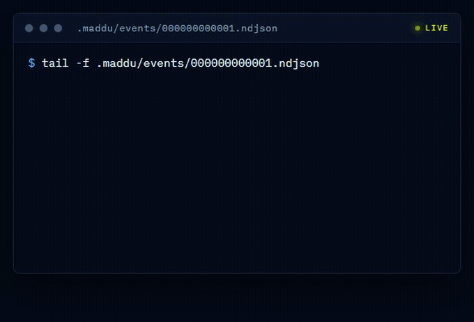
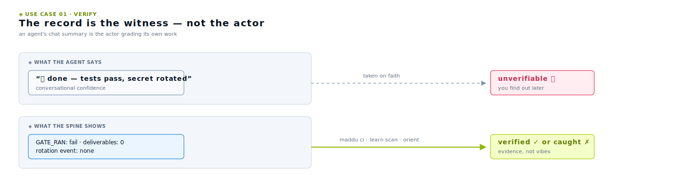
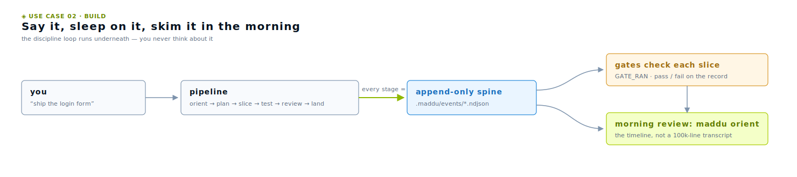
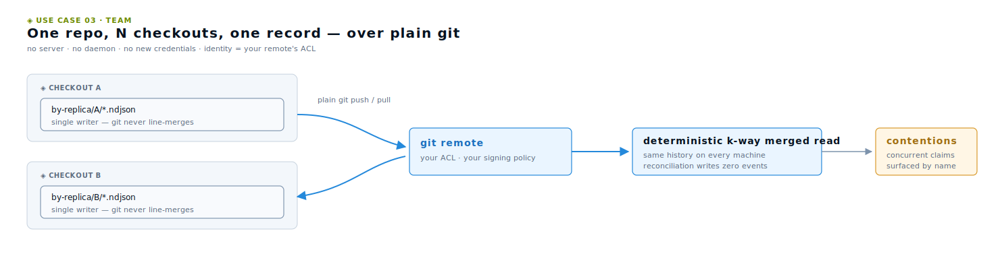
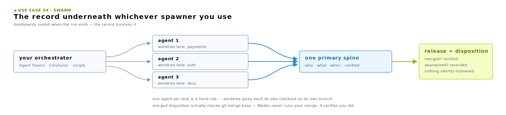
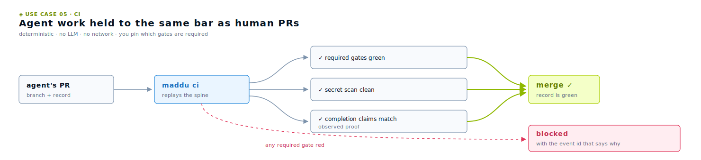
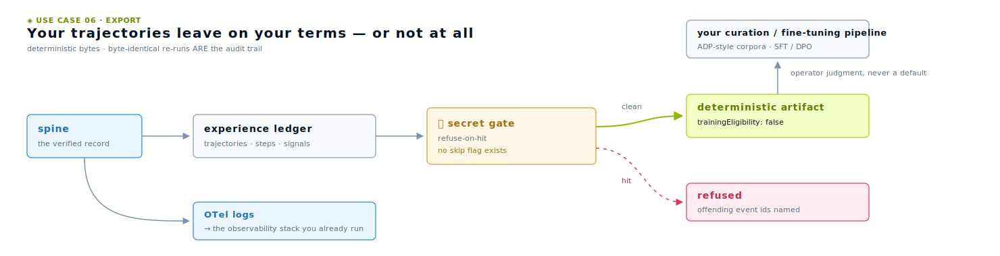
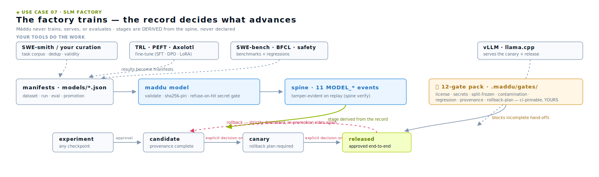

<div align="center">

<picture></picture>

# Máddu

### Your AI agents are temporary. The system that governs them shouldn't be.

**Máddu is the external record that verifies what your AI agents did, so no agent is ever the sole witness to its own work.** It's a local-first, files-only spine that any AI coding agent (Claude Code, Codex, or any CLI) plugs into to work as an **auditable team**: one agent per lane, risky changes held behind approvals, every slice checked by a gate. *Cooperative* means exactly that. The agent calls Máddu; Máddu never sits in the request path and never touches your keys. It runs as a small Node process with local-first, append-only files as the system of record: each approval, session, and slice is one line on disk. The durable, verifiable record is *how* the governance earns your trust, not what it sells.

*New to AI agents?* They're terminal tools that write and change code for you. Máddu is the layer underneath them that keeps them **honest**: one agent per lane, sensitive changes waiting on your approval, every step on a record you can replay and check, instead of a black box that vanishes when the session closes.

[](https://github.com/frdyx/maddu/actions/workflows/maddu-ci.yml)
[](version.json)
[](https://nodejs.org)
[](LICENSE)
[](#why-maddu)

```bash
npx github:frdyx/maddu init
```

**No cloud. No database. No provider SDKs in your code.**
Máddu spawns no models, stores no secrets, calls no clouds.

[Homepage](https://maddu.frdyx.com) · [Quickstart](docs/01-getting-started.md) · [Use cases](#seven-ways-people-run-it) · [Why Máddu](#why-maddu) · [Slash commands](docs/22-slash-commands.md) · [Hard rules](docs/hard-rules.md)

</div>

---

<div align="center">

<a href="https://maddu.frdyx.com"><picture></picture></a>

<sub>*The cockpit, dogfooded on Máddu's own repo — every tile read live from the append-only spine.*</sub>

</div>

## The problem

You've handed real work to AI agents. They claim lanes, request approvals, ship slices, hand off to each other — often several at once. And the moment a session ends, the control goes with it.

- **Who's actually in charge?** Two agents editing the same thing, and nothing holding the line between them.
- **Did that approval get honored — or just clicked past?** You can't tell from a chat log you can't grep, on a machine you're not on.
- **Can I trust what happened while I was away?** Scattered across SQLite files, vendor dashboards, and agent memory you can't inspect — with no way to prove it wasn't quietly rewritten.

Agents are getting more autonomous. The thing that **governs and coordinates** them shouldn't be the least durable part of your stack.

Tracing tools observe runs. Memory layers help agents remember. **Máddu governs how agents collaborate.**

## The category

**Local-first cooperative agent governance.** Not a control plane, not a gateway, not a proxy — a governance layer the agent itself calls; one NDJSON file you can `tail`; nothing leaves your machine. *Local-first* is operational, not marketing: delete `.maddu/` and Máddu is gone — and `git clone` brings the whole governance history with it. Enterprise platforms govern **which** agents run in your org; **Máddu governs *how* they work** once they're in your repo. The canonical definition — and why every nearby name already means something else — lives in [docs/45-category.md](docs/45-category.md).

Frameworks build the agent. Durable-execution engines keep it running. Observability watches the model. Memory layers feed the agent's future. Orchestrators spawn the swarm. **Máddu is the neutral record your repo owns that lets you *verify* what any of them actually did — and govern what leaves.**

## The idea

One append-only log on disk is the single source of truth. Everything else is derived from it — and thrown away on conflict.

That's the whole bet. When every approval, session boundary, lane claim, and slice of work is **one line in one file**, the hard questions get easy:

```bash
tail -n 1 .maddu/events/000000000001.ndjson
```
```json
{"v":1,"type":"SLICE_STOP","actor":"ses_20260518081409_b7f312","data":{"summary":"wired the bridge to my repo"}}
```

Every state question reduces to `tail`, `grep`, or `git log` on a file you already own. No SQLite to crack open. No dashboard between you and the truth. The log replays deterministically on any machine, so the answer is the same everywhere — forever.

<div align="center">

<a href="https://maddu.frdyx.com"></a>

<sub>*Every event you'll ever debug is one line in this file.*</sub>

</div>

### The discipline loop is the product

What Máddu gives **every** install, from day one, is the always-on core: register a session, claim a lane, run a slice, stop it with a structured summary, let the gates check it — each one line on the spine. That disciplined substrate is the value; it's what makes the history trustworthy. Multi-agent **orchestration** (`coordinator`, `loop`, `pipeline`, `team`) is a powerful **opt-in** layer on top — reach for it when a job fans out across lanes, skip it when it doesn't. Most work just needs the loop, and that's by design. (See the [charter](docs/charter.md#capability-layers--positioning-v1800) for the core-vs-orchestration split.)

And with `maddu hooks install`, the loop stops being advisory: a `PreToolUse` hook **blocks a mutating edit** when the ritual is stale — no session, no lane, no governing goal/plan, an overdue slice-stop, or uncommitted work piling up — so an agent can't silently drift off the record. It's **tier-scaled** by governance (`strict` blocks, `standard` warns then blocks, `relaxed` only nudges), **fails open** (any error allows the edit; it never crashes a tool), and **never gates the remedy** (`maddu slice-stop`, `git commit`…), so the fix is always one command away. Claude Code-specific; every runtime still gets the record. See [Session hooks](docs/44-session-hooks.md#discipline-enforcement-the-pretooluse-gate).

## How it works

Three moving parts, and nothing else:

| Part | What it is | What it does |
|---|---|---|
| 🧬 **The spine** | `.maddu/events/*.ndjson` — an append-only event log | The single source of truth. Every approval, session, lane claim, and slice is one line. Replays deterministically on any machine. |
| 🌉 **The bridge** | One Node process on `127.0.0.1:4177` | Serves the cockpit over loopback, runs the gates, spawns agent workers with credentials handed in at spawn-time. Imports **zero** provider SDKs. |
| 🛰️ **The cockpit** | A static HTML+JS page the bridge serves | A read-only window onto the spine and its projections — watch and replay what your agents did, in any browser. |

Everything under `.maddu/state/` is a *projection*: rebuildable from the spine, discarded on conflict. **The spine always wins.** There is no `maddu spine repair` by design — corruption surfaces by name, with file-and-line precision, and *you* decide what to do about it.

<a href="docs/images/spine-and-event-flow.svg"><picture></picture></a>

### The record is a contract, not just a log

Append-only and hash-chained means a naive after-the-fact edit can't pass unnoticed — it breaks the forward `prev_hash` link and `spine verify` FAILs (the chain is unkeyed, so a determined actor who recomputes the whole chain, truncates the tail, or edits only the last event is out of scope — the OS's job; see the [threat model](docs/34-threat-model.md)). Máddu goes one step further: every event conforms to a **published, versioned contract** — 177 typed event types emitted as a real JSON Schema ([`docs/event-schema.json`](docs/event-schema.json), draft 2020-12), fingerprinted so it can't silently drift (a shape change fails CI without a matching semver bump; the version rides on the record itself as `x-contractVersion`). So your governance record isn't only tamper-detecting — it's **independently checkable**: someone who trusts neither you nor Máddu can validate the spine against its own published contract with off-the-shelf tooling.

```
docs/event-schema.json     the published contract (JSON Schema, draft 2020-12 · x-contractVersion 1.5.0)
                           → validate any spine event against it with ajv, check-jsonschema, or any validator
```

That's the point of *don't let the actor be the sole witness*: the witness is a contract a third party can verify, not a log you're asked to trust. (And it's write-safe to hand over — every event's payload is redacted at the write boundary, so the record you share can't leak a pasted secret.)

## Get running in 60 seconds

```bash
$ npx github:frdyx/maddu init
Máddu v1.97.0 installed.

Next step: open this repo in Claude Code or Codex CLI and type:

  /maddu-help                # discover the slash-command surface
  /maddu-suggest <task>      # "what should I run for X?"
  /maddu-autopilot <task>    # end-to-end task pipeline
```

That's it. The operator surface is **slash commands** — no flags to memorize, no CLI verbs to recall. Type a slash command (or just natural language — *"ship the login form"*, *"status"*, *"tokens"*) and the agent classifies your intent, dispatches the right action, and tells you which one it chose.

For any non-trivial feature or fix, the agent reaches for a **pipeline** by default — `maddu pipeline run ship-a-feature "<goal>"` (plus `fix-a-bug` and `plan-and-delegate`) — walking one canonical flow: *orient → plan → coordinate → slice → test → review → land → account*.

> **Power users & CI:** the verbose CLI is always there — it's what the slash commands dispatch under the hood. `./maddu/run start`, `./maddu/run register`, `./maddu/run slice-stop "…"`. Full walkthrough → [docs/01-getting-started.md](docs/01-getting-started.md).

## The operator surface

Inside Claude Code or Codex CLI, you drive everything from one line:

| Slash command | What it does |
|---|---|
| `/maddu-autopilot <task>` | End-to-end: register → suggest lane → claim → plan-exec-verify-fix → slice-stop. |
| `/maddu-plan <topic>` | Plan-only stage; writes a brief artifact. |
| `/maddu-team <N> <task>` | Open N child sessions with disjoint lanes — agents never collide. |
| `/maddu-review [slice-id]` | Post-stop review of a slice. |
| `/maddu-status` | Pretty-print state across surfaces. |
| `/maddu-cost` | Token / call rollup per session, day, runtime, model. |
| `/maddu-doctor` | Run hard-rule gates and surface findings. |
| `/maddu-learn [run\|digest]` | Mine past sessions for failed→succeeded tool calls; distil project corrections. |
| `/maddu-orient` | Session-start briefing: goal + success-progress + curated handoff. |
| `/maddu-blueprint` | Export how a project was built as a portable, variable-driven handoff. |

…and a dozen more (`/maddu-skill`, `/maddu-insights`, `/maddu-debt`, `/maddu-architecture`, `/maddu-handoff`, `/maddu-advise` …). Full reference → [22-slash-commands.md](docs/22-slash-commands.md) + [natural-language routing](docs/23-natural-language-routing.md).

And for the person who **can't read the code** — the one on the hook for what the agent did — there's a read-only **Operator Plane** on top of the same record: `maddu status --line` (a one-line on-goal/drift segment, wireable into the status line), `maddu orient --digest` ("while you were away"), an **oversight** readout of what a skill was *fed vs withheld* and the plain-language why (`maddu spine oversight`), a per-project cockpit, a **decision ledger** whose every row ties to the tamper chain, and a cross-workspace **portfolio wall** that surfaces which repos *need a human*. All read-only projections — nothing new is written to make them. See [Oversight](docs/52-oversight.md) and [the Operator Plane](docs/53-operator-plane.md).

## Seven ways people run it

Same substrate, seven shapes of work. Every workflow below is real commands against the same append-only record — pick the one that looks like your week.

### 🔍 1. Verify the agent instead of trusting it

**For anyone who's been burned by "done ✅, tests pass" that wasn't.** The 2026 lesson of agentic coding is that generation stopped being the bottleneck — *verification* is. An agent's chat summary is the actor grading its own work. Máddu makes the record the witness instead.

```bash
maddu hooks install            # sessions auto-register; nothing runs unrecorded
# … agent works, then:
maddu slice-stop "…"           # deliverables + gates + learnings → one line on the spine
maddu learn scan               # hedged "should work now" claims vs OBSERVED proof
maddu orient                   # goal progress verified by real commands, not vibes
```

<picture></picture>

Every completion claim is joined against *observed* evidence — real gate passes, verified deliverables, actual diffs. A model checking a model is a second opinion; **this is evidence.**

### 🚀 2. The independent app builder

**For the solo dev shipping a real product with Claude Code or Codex.** You don't want ceremony — you want to say *"ship the login form"*, walk away, and trust what you find when you come back. The discipline loop runs underneath without you thinking about it.

```bash
npx github:frdyx/maddu init && maddu hooks install    # once
/maddu-autopilot ship the login form                  # end-to-end pipeline
# overnight run? every iteration lands as a slice-stop with gate results
maddu orient                                          # morning: the timeline, not a 100k-line transcript
```

<picture></picture>

Overnight autonomous runs become reviewable: pre-compaction checkpoints mark what survived context loss, the focus instrument tags each turn toward/lateral/away from your declared goal, and the morning is a ten-minute skim of slice-stops with gate badges — not an archaeology dig.

### 👥 3. A team sharing one repo

**For teams whose agents (and humans) keep stepping on each other.** The record syncs through the git remote you already have — no server, no daemon, no new credentials, no vendor between you and your own history.

```bash
maddu spine sync init          # opt in; this checkout gets its own partition
maddu spine sync               # commit own segments → pull → validate → audited push
maddu status                   # contentions surface BY NAME — never silent double-writes
```

<picture></picture>

Each checkout appends only to its own partition, so git never line-merges the record. Identity rides your remote's own access control. Concurrent claims on the same lane don't corrupt anything — the merged read surfaces them as **contentions** with the superseded sessions named.

### 🐝 4. A swarm of parallel agents

**For operators running 3–20 coding agents at once** — with Agent Teams, Conductor, Claude Squad, or your own scripts. Git worktrees became the consensus isolation primitive; Máddu is the durable record *underneath* whichever spawner you use, not a competing one.

```bash
maddu lane claim payments --worktree    # isolated checkout, bound to the claim
# … each agent works its own lane, appends to the SAME primary spine …
maddu lane release payments --worktree merged   # explicit disposition — verified, not asserted
```

<picture></picture>

One agent per lane is a hard rule, `--worktree` gives each its own checkout on its own branch, and `merged` disposition actually checks `git merge-base` — Máddu never runs your merge, it verifies you did. The dashboards vanish when the run ends; **the record survives it.**

### ✅ 5. CI for agents

**For repos that want agent work held to the same bar as human PRs.** One CI step reads the record and exits nonzero when the evidence is missing — deterministic, no LLM, no network.

```yaml
- run: npx github:frdyx/maddu ci     # gates ran? deliverables real? secrets clean? claims backed?
```

<picture></picture>

You pin which gates are required (`maddu ci pin`), so framework upgrades can never turn your pipeline red without your opt-in. Same exit code drives GitHub Actions, GitLab, or a fully-offline git pre-push hook.

### 🎓 6. Governed experience data — for training pipelines and audits

**For teams fine-tuning small models on their own agent trajectories, and for anyone who owes an auditor an account.** The 2026 training stack standardized the *format* for agent-trajectory data — but the leading protocol's own paper leaves redaction, secrets, and governance explicitly out of scope. That's the part Máddu does.

```bash
maddu experience                      # the spine as trajectories of typed steps + outcome signals
maddu evolve plan                     # evidence-gated recommendations — or an honest "change nothing"
maddu experience export --format atdp --out exp.atdp.json   # the governed boundary
maddu export --otel                   # or: OpenTelemetry logs into the stack you already run
```

<picture></picture>

The export is deterministic (byte-identical re-runs — that *is* the audit trail), refuses outright on any secret-shaped value with **no flag to override**, and ships `trainingEligibility: false` until *you* — not a regex — judge the data. It's the honest on-ramp into trajectory-curation pipelines, not a dataset grab. And if regulation is on your radar: record-keeping regimes like the EU AI Act (Art. 12) push toward automatic, reconstructable logs of AI-assisted decisions — an append-only record you own and retain locally is a building block for that traceability, not a compliance product.

### 🏭 7. The SLM factory — governing model training

**For teams fine-tuning domain-specific small models.** TRL/PEFT train, vLLM serves, SWE-bench and BFCL evaluate — excellent tools at every step, and none of them is the neutral record of what happened *between* the steps. Máddu is: datasets, training runs, evals, and promotions land as hash-pinned manifests on the spine, and a checkpoint's stage is **derived from the record** — a manifest can't claim its way toward production.

```bash
maddu model dataset snapshot models/tickets-v3.json  # license, split, provenance — recorded + pinned
maddu model train complete models/run-42.json        # config of record: base hash, seed, commit
maddu model eval record models/eval-7.json           # + critical regressions: acknowledged or blocking
maddu model promote models/promote.json              # the approval ride — no auto-decide near production
maddu model gates install                            # 12 ML-lifecycle gates in .maddu/gates/ — yours, ci-pinnable
```

<picture></picture>

Every promotion above candidate waits for an explicit per-request decision — standing approval policies are deliberately inert near production. Rollback is strictly downward and re-promotion goes back through the full ride; the spine verifier holds the whole ladder tamper-detecting on replay. And the honesty line is structural: Máddu records what your tools *declared* and pins the bytes of record — it never trains, serves, evaluates, or decides that a model is good. Full guide: [51-slm-governance.md](docs/51-slm-governance.md).

## What it does for you

The spine is the foundation. This is what you actually get standing on top of it — every item is a real command, and every step it takes lands as an event on the spine.

| Capability | What it gives you | Run it |
|---|---|---|
| 🎛️ **Zero learning curve** | Slash commands or plain English — the agent classifies your intent, runs the right thing, and tells you which. No flags to memorize. | `/maddu-help` |
| 🧭 **Architecture-drift detection** | Declare your module boundaries; Máddu diffs the contract against the *real* import graph and fails CI on new forbidden edges or cycles — with a diagram + ratchet. | `/maddu-architecture` |
| 📦 **Blueprint a whole build** | Distil *how a project was built* into one portable, variable-driven handoff — intake → procedure → problems & fixes — optionally polished to prose. | `/maddu-blueprint` |
| 🧠 **Agents that learn from mistakes** | Mines past transcripts for failed→succeeded tool calls and writes typed corrections into the project's `CLAUDE.md` + memory, so the next agent stops repeating them — `learn sync` federates the portable ones across your repos, and `learn sync --from-claude-memory` imports Claude Code's own auto-memory as provenance-carrying facts (import-only, deduped). | `/maddu-learn` |
| 🧷 **Session discipline by default** | One `maddu hooks install` wires Claude Code hooks so every session auto-registers to the spine, auto-closes, and writes a **governance checkpoint before every context compaction** — the durable record marks exactly what survived, and `orient` announces it on resume. | `maddu hooks install` |
| 🧾 **Completion claims, verified** | A deterministic check (no LLM) joins hedged "done" claims ("should work now") against *observed* proof — real gate passes, verified deliverables — and a warn-tier gate surfaces any live pattern at every slice-stop. A model checking a model is a second opinion; this is evidence. | `maddu learn scan` |
| 🧊 **Sterile release phases** | Declare a phase with a governance tier and discipline escalates for exactly that window — stricter approvals, tighter loops — then lifts on `phase clear`. Escalation-only: a phase can never silently weaken your baseline. | `maddu phase set --tier strict` |
| 🪜 **Earned autonomy** | The same record that catches hollow claims can vouch for a lane: a deterministic Wilson-scored trust ladder over verified slice outcomes **recommends — never applies —** relaxing (or reverting) a lane's governance tier. Trust is earned on the record, not asserted. | `maddu autonomy` |
| 🤝 **Git-native team sync** | Share the governance record between checkouts through the git remote you already have — no server, no daemon, no new credentials. Author-partitioned segments merge deterministically; concurrent lane claims surface as named **contentions** instead of silent double-writes. | `maddu spine sync` |
| 🧪 **Parallel agents, isolated worktrees** | `lane claim --worktree` gives each agent an isolated git worktree bound to its lane claim — parallel agents never touch the same checkout, and release requires an explicit merged/abandoned/keep disposition so work is never silently orphaned. | `maddu lane claim <id> --worktree` |
| 📖 **The experience ledger** | Re-read the spine as session trajectories of typed steps with late-bound outcome signals (gate results, review verdicts) attached to the work they judged — pure read-time derivation, zero writes, step ids ARE event ids. | `maddu experience` |
| 🌱 **Recommend-only evolution** | Four deterministic detectors mine the ledger for evidence-gated improvements (≥3 occurrences across ≥2 scopes); you adopt through already-audited write paths, or it tells you honestly that changing nothing is the right call. Compute, recommend, stop. | `maddu evolve plan` |
| 📤 **Governed exports** | Hand the record to the outside world on your terms: OpenTelemetry logs for your existing observability stack, or a deterministic ATDP experience artifact behind a **refuse-on-hit secret gate with no skip flag** and `trainingEligibility: false` until *you* say otherwise. | `maddu export --otel`, `maddu experience export` |
| ✅ **A real testing harness** | Runs your project's tests with adaptive profiles; `self-test` runs the framework's own suite, backed by a dogfooded multi-layer gate. | `/maddu-test` |
| 🗂️ **One bridge, every repo** | Mount N repos on one bridge; `/_all/*` fans out reads across all of them, each row tagged by workspace. Each repo's spine stays its own truth. | `/maddu-status` |
| 🛰️ **Fleet view + staged upgrade** | See every Máddu install on your machine at a glance — version, liveness, how far behind — computed offline without running any of them. Then `fleet upgrade --plan` previews exactly what a delivery would change and which repos are safe to touch, and `--apply` delivers it: snapshot → upgrade → per-repo doctor, **halt-on-red**. | `maddu fleet` |
| 💰 **Cost accounting** | Token and call rollup per session, day, runtime, and model — so you can see what your agents actually spent, with an opt-in `cost-budget` gate that WARNs when a session runs hot. | `/maddu-cost` |
| 🚦 **Default pipelines** | One canonical flow — orient → plan → coordinate → slice → test → review → land → account — as `ship-a-feature`, `fix-a-bug`, `plan-and-delegate`. | `/maddu-autopilot` |
| 🔬 **Insights + debt ledger** | See what's actually used vs merely defined, and keep a ledger of deliberate shortcuts — flagged when they have no upgrade trigger. | `/maddu-insights`, `/maddu-debt` |

### 🎛️ Zero learning curve

There's nothing to memorize. Inside Claude Code or Codex, type a slash command — or just say what you want:

```text
ship the login form        → runs the ship-a-feature pipeline
status                     → /maddu-status
tokens this week           → /maddu-cost
what should I run for X?    → /maddu-suggest
```

The agent reads your intent from `MADDU.md`, dispatches the matching command, and **tells you which one it chose** — so you learn the surface by using it, not by studying it. The verbose CLI stays first-class underneath for scripts and CI; the slash layer is just the part humans touch.

### 🧭 Architecture-drift detection

Most "architecture" lives in a diagram that's wrong by the next sprint. Máddu makes it executable. You declare the allowed module boundaries once in `.maddu/config/architecture.json`; then `maddu architecture` builds the **real** import graph from your code and diffs it against the contract:

- **Drift, by name** — forbidden cross-area edges, dependency cycles, and undeclared areas, each reported with file precision.
- **A diagram you can trust** — it renders the actual graph as mermaid, generated from the code, not hand-drawn.
- **A CI gate with a ratchet** — the `architecture-drift` gate fails on a `failOn` ladder (`none` / `new` / `any`), and a structural-mass baseline enforces *"monoliths may only shrink."* Drift can't sneak in between reviews.

### ✅ Governance as a merge requirement

`maddu ci` runs every deterministic gate headlessly — no LLM, no network — and exits nonzero **only on gates your repo has pinned as required** (`maddu ci pin`), so framework upgrades can add gates without ever turning your pipeline red until you opt in. One branch-protection rule later, agent work doesn't merge unless the governance record is green:

```yaml
- uses: actions/checkout@v4
- uses: actions/setup-node@v4
  with: { node-version: 20 }
- run: npx github:frdyx/maddu ci
```

No GitHub? No problem — the same exit code drives a fully-offline git pre-push hook (`exec maddu ci`) or any other CI system. Failed required gates surface as GitHub annotations plus a one-table job summary when Actions is detected. Full contract in [docs/46-ci.md](docs/46-ci.md).

## Why Máddu

Six design choices — and the thing each one lets you do that you couldn't before.

<table>
<tr>
<td width="50%" valign="top">

### 🔎 Audit with `cat`
Every approval, session boundary, and slice-stop is one line in one file. Introspect the system with shell tools you already trust — no SQLite to crack open, no log aggregator to provision, no dashboard between you and the truth.

</td>
<td width="50%" valign="top">

### ♻️ Survive a rebuild
Delete `.maddu/state/`, rebuild from the spine on any machine, get the *exact same* ledger. Decisions live as real events, never as derived state — audit immutability is operator-provable, not declared in a doc.

</td>
</tr>
<tr>
<td width="50%" valign="top">

### 🛡️ Tamper-detecting bedrock
`maddu spine verify` walks every segment for parseability, id-uniqueness, continuity, monotonicity, referential integrity, torn-line detection, and a forward `prev_hash` chain. On a post-cutover (v1.98.0+, locked) chain an interior edit, deletion, insertion, or prev_hash-strip is a **FAIL**. It's unkeyed — it catches naive/accidental edits and partial tampering, not a determined local actor who recomputes the whole chain (the OS's job). No `spine repair` exists — *you* decide remediation.

</td>
<td width="50%" valign="top">

### 🗂️ One bridge, every repo
Switch context across five repos without booting five bridges. `maddu workspace add` mounts each repo; `/bridge/_all/*` fans out reads across all of them. Each repo's spine stays its own source of truth.

</td>
</tr>
<tr>
<td width="50%" valign="top">

### 🧠 Memory through structured events only
Nothing enters long-term memory without a structured event saying so. `SLICE_STOP` feeds hindsight; `maddu learn` distils corrections from past failed→succeeded tool calls. Both replay on rebuild — memory stays auditable, replayable, and deletable.

</td>
<td width="50%" valign="top">

### 🔌 Zero provider SDKs, zero cloud relay
SDK churn from Anthropic, OpenAI, or Google never reaches your orchestrator. Provider calls happen only inside spawned workers, credentials stay device-bound, and `maddu export` scrubs them on the way out. Your credentials never traverse a remote service.

</td>
</tr>
</table>

## The 8+1 hard rules

Nine invariants. `maddu doctor` verifies them on every install and every upgrade; `maddu audit` traces each one to the gate that enforces it. **A repo that violates any of them is not a Máddu repo.**

> These rules govern **how Máddu itself is built** — its own orchestration code — *never* the product you build with it. The app you ship can use any database, SDK, or backend it needs. See the scope banner in [`docs/hard-rules.md`](docs/hard-rules.md).

| # | Rule | What it prevents |
|---|---|---|
| 1 | Files-only state | SQLite corruption, opaque feature state, schema-migration hazards |
| 2 | Append-only event spine (tamper-detecting) | Mutable history, replay-divergence, silent interior rewrites |
| 3 | No hosted backends | Telemetry, vendor lock-in, "Máddu Cloud" |
| 4 | No broad dependencies | Supply-chain risk, transitive vulnerabilities |
| 5 | No provider SDKs in app code | Hidden API keys, SDK churn in the orchestrator |
| 6 | No token export | Portable credentials, cross-machine leak |
| 7 | Three-layer brand boundary | Framework / app / content brand bleed |
| 8 | Lane ownership | Two agents writing the same files |
| 9 | Every auto-trigger crosses the gauntlet | Off-the-record automation mutating state |

Full text and rationale → [docs/hard-rules.md](docs/hard-rules.md).

## Documentation

| Start here | Concepts | Reference | Operations |
|---|---|---|---|
| [Getting started](docs/01-getting-started.md) — install, boot, first slice | [Concepts](docs/02-concepts.md) — spine, projections, lanes, slices | [CLI reference](docs/03-cli-reference.md) — every `maddu` subcommand | [Multi-workspace](docs/19-multi-workspace.md) — one bridge, N repos |
| [Team sync](docs/49-team-sync.md) — share the record via your git remote | [Experience & evolve](docs/50-experience-evolve.md) — the ledger + recommend-only planner | [Event contract](docs/event-schema.md) — the published v1.5.0 schema | [CI gate rail](docs/46-ci.md) — `maddu ci` in any pipeline |
| [Five-minute tour](docs/18-first-slice.md) — for new operators | [Hard rules](docs/hard-rules.md) — the 8+1 invariants | [Bridge endpoints](docs/05-bridge-endpoints.md) — full HTTP surface | [Troubleshooting](docs/13-troubleshooting.md) — common fixes |
| [Cockpit tour](docs/04-cockpit-tour.md) — every route | [Governance](docs/20-governance.md) — gates, scope-lock, triggers | [Architecture](docs/15-architecture.md) — two-process model, tamper-detection | [Threat model](docs/34-threat-model.md) — the boundaries Máddu defends |

Design tokens, typography, motion → [docs/DESIGN-SYSTEM.md](docs/DESIGN-SYSTEM.md). Full version history → [CHANGELOG.md](CHANGELOG.md).

## Why the name

*Máddu* (North Sámi) means **root, origin, ancestry** — the spirit-source from which an instance descends. Pronounced **MOD-doo**. The name isn't decoration: every action, claim, slice, and approval in this framework descends from a recorded ancestor on an append-only event spine. The word captures that property more precisely than any English equivalent we tried.

## License

Apache-2.0. See [`LICENSE`](LICENSE).

*Homepage:* [maddu.frdyx.com](https://maddu.frdyx.com) · *Source & issues:* [github.com/frdyx/maddu](https://github.com/frdyx/maddu/issues).

*Contributing:* Máddu is post-1.0 but evolves fast — expect tag-boundary changes, and read [`docs/charter.md`](docs/charter.md) for the invariants that won't.

<div align="center">

---

**Máddu spawns no models, stores no secrets, calls no clouds.**

</div>
