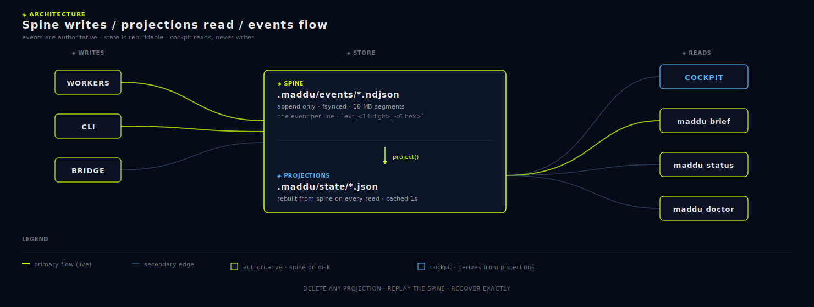
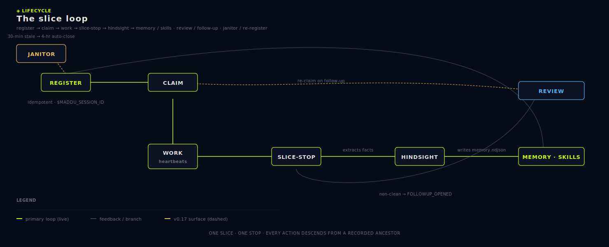

# Concepts

The mental model for working with Máddu. Read this once and the rest of the docs will read as reference.

<a href="images/spine-and-event-flow.svg"><picture></picture></a>

## Files-only state

Every piece of state **Máddu** writes is a plain file under `.maddu/`. No SQLite. No embedded DB. No hosted service. If you can `cat` it, Máddu wrote it; if you cannot, Máddu did not.

> **Scope:** this is about *Máddu's own* orchestration state, not the product you're building with Máddu. Your application may use SQLite, Postgres, a hosted DB, object storage — whatever it needs. The files-only rule constrains the framework layer (`.maddu/` + `maddu/`), never your app. See the scope note in [hard-rules.md](hard-rules.md).

```
.maddu/events/000000000001.ndjson   # the spine — one event per line
.maddu/state/*.json                 # projections rebuilt from the spine
.maddu/lanes/catalog.json           # the lane catalog
.maddu/lanes/claims.json            # current lane claims (projection)
.maddu/lanes/<lane>/mailbox.ndjson  # per-lane mailbox
.maddu/skills/*.md                  # SKILL.md format
.maddu/auth/                        # OAuth token paths (gitignored)
```

This is non-negotiable — it is hard rule #1. See [06-hard-rules.md](06-hard-rules.md).

## Append-only event spine

The spine is `.maddu/events/*.ndjson`. Every event is one line of JSON with this shape:

```json
{"v":1,"id":"evt_2026...","ts":"2026-05-14T12:34:56.789Z","type":"SLICE_STOP","actor":"ses_...","lane":"harness","data":{}}
```

Events are never edited or deleted. Order is the insertion order. When the spine and a projection disagree, the spine wins — projections are rebuildable; the spine is not.

Read events with `maddu events list`, tail them with `maddu events tail`, or long-poll the bridge at `/bridge/events/wait`.

## Projections

A projection is a JSON file in `.maddu/state/` derived purely from the spine. Examples: the lane-claims map, the active-sessions list, the slice-stop archive, the task graph, the memory index.

The contract: any projection can be deleted and rebuilt by replaying the spine. The bridge does this implicitly on every read — it calls `project(repoRoot)` and returns a fresh snapshot. You never write to a projection by hand.

Example: the cockpit Dashboard route renders by fetching `GET /bridge/projection`, which is computed from the spine on every request.

## Workspaces

A **workspace** is the scope above a repo: one entry in the device-local registry at `~/.config/maddu/workspaces.json` (Linux/macOS) or `%APPDATA%\maddu\workspaces.json` (Windows). Each entry pairs a kebab-case `id` (e.g. `client-acme`) with the absolute path to a repo containing `.maddu/`, plus reporting metadata such as `label` and `role`.

```bash
$ maddu workspace add ~/projects/maddu --id maddu --label "Máddu"
$ maddu workspace add ~/projects/client-acme --id acme  --label "Acme"
$ maddu workspace list
```

The bridge mounts every registered workspace at once and routes each HTTP request to one of them via the `X-Maddu-Workspace` header. The cockpit's left rail header surfaces a switcher; `Ctrl+K` exposes "Switch to workspace: …" actions. With no registry the bridge falls back to walking up from `cwd` for a single `.maddu/`, so existing single-repo installs keep working.

The registry is device-bound — it follows the same path pattern as auth tokens and is **never** committed or synced across machines. Each repo's `.maddu/` remains the sole source of truth for that repo; the registry is just orchestration scaffolding.

Workspace roles are reporting metadata only: `project` is the default, `fixture` marks canary/test repos that should stay in fleet audits, and `archive` marks registered repos kept for reference. Roles do not change routing or gate behavior.

## Lanes

A **lane** is a scoped, mutually-exclusive area of work. Examples: `cockpit-shell`, `bridge-server`, `auth-providers`, `harness`, `wiki`. The full catalog is in [lanes.md](lanes.md).

Before an agent edits files in an area, it **claims** the lane. While the claim is held, no other session may claim the same lane. Cross-lane work routes through the mailbox bus — never via shared mutation.

```bash
$ maddu lane claim --lane cockpit-shell --session ses_... --focus "redesign approvals route"
```

See [07-lanes-and-sessions.md](07-lanes-and-sessions.md) for the lifecycle.

## Sessions

A **session** is a registered agent instance. A human at a terminal, a Claude Code subprocess, a Codex run — anything that intends to write events registers a session and gets back a `ses_...` id.

```bash
$ maddu session register --role implementer --label "Claude — slice 12" --focus "ship approvals"
```

Sessions emit `SESSION_REGISTERED`, `SESSION_HEARTBEAT`, and `SESSION_CLOSED` events. They are the actor field on every other event the agent writes.

A session may hold zero or more lane claims. A claim without a session is impossible by construction.

## Slices

<a href="images/slice-lifecycle.svg"><picture></picture></a>

A **slice** is the smallest unit of work that has a beginning, an outcome, and a written record. There is no formal "slice start" event — a slice begins implicitly when a session claims a lane and starts editing. A slice ends explicitly with a `maddu slice-stop`.

A slice is not a commit, not a branch, not a sprint. It is one focused chunk of agent activity that produces one slice-stop record.

## The slice-stop ritual

Every slice ends with a structured slice-stop. It is the only path into hindsight memory and the only way the framework learns from agent activity.

```bash
$ maddu slice-stop \
    --session ses_... \
    --lane cockpit-shell \
    --summary "Approvals route renders open approvals + ledger" \
    --action "Wrote renderApprovals, wired badge counter" \
    --targets "cockpit.js,cockpit.css" \
    --paths "maddu/cockpit/" \
    --gates "doctor,events-replay" \
    --learnings "Approvals must auto-decide via policy before surfacing" \
    --next "Wire deny-always policy in CLI" \
    --reason "ship the approvals route"
```

What slice-stop produces:

1. A `SLICE_STOP` event on the spine.
2. Hindsight extraction over the payload's `learnings`, `targets`, `gates`, etc. → new facts in `.maddu/state/memory.ndjson`.
3. A surface in the cockpit's Operations route and in `maddu status`.

See [08-slice-stop-ritual.md](08-slice-stop-ritual.md) for the full payload reference.

## Mailbox bus

A **mailbox** is a per-lane NDJSON file at `.maddu/lanes/<lane>/mailbox.ndjson`. When lane A needs lane B to do something, it sends a message:

```bash
$ maddu mailbox send cockpit-shell \
    --type request \
    --from ses_... \
    --subject "Add badge for stuck workers" \
    --body "Workers silent >15s should surface red dot in the rail."
```

The lane B owner sees it in the cockpit Mailbox route (or via `maddu mailbox list cockpit-shell`), reads it, and acks. This is the only sanctioned cross-lane coordination primitive. Shared mutation across lanes is a hard-rule violation.

Message types: `note`, `info`, `request`, `handoff`, `question`, `ack`.

## Approvals ledger

When an agent wants to do something sensitive — spawn a subprocess, write outside its lane, hit an external API — it requests approval through the bridge. The operator decides: `allow-once`, `allow-always`, `deny`, or `deny-always`.

Standing policies live in the projection at `.maddu/state/approvals.json`. A standing `allow-always` policy auto-decides matching future requests; the operator sees the auto-decision in the ledger.

See [09-approvals-and-permissions.md](09-approvals-and-permissions.md).

## Hindsight memory

`.maddu/state/memory.ndjson` is a derived projection of every `SLICE_STOP` event. The hindsight extractor parses the slice-stop payload and emits typed facts:

- `rule` — explicit rules from `learnings`.
- `constraint` — discovered constraints.
- `discovery` — new findings.
- `followup` — items from `next`.
- `touched` — files touched.
- `gate` — gates that ran.
- `summary` — the slice summary.

Each fact carries provenance back to the originating event. Search them with `maddu memory search <query>` or the cockpit Search route.

Memory is rebuildable. `maddu memory extract --rebuild` recomputes the whole file from the spine.

## Skills

A **skill** is a reusable agent instruction in the SKILL.md format, stored at `.maddu/skills/<id>.md`. Skills are operator-promoted distillations of one or more slice-stops — they are the "how do we do X here" memory of the project.

```bash
$ maddu skill from-slice evt_2026...    # distill a SKILL.md from a slice-stop
$ maddu skill list
```

See [10-skills-and-hindsight.md](10-skills-and-hindsight.md).

## Runtimes and MCP

A **runtime** is a pluggable subprocess capability — `claude`, `codex`, `node`, anything Máddu can `spawn`. Each runtime is registered with a descriptor under `.maddu/runtimes/<name>.json`. The bridge spawns workers via the runtime descriptor; credentials are injected at spawn time.

**MCP** (Model Context Protocol) servers are registered with the bridge under `.maddu/mcp/<name>.json`. Servers may be `stdio`, `sse`, or `http` transports, and may be scoped to specific lanes.

See [11-runtimes-and-mcp.md](11-runtimes-and-mcp.md).

## Auth and imports

OAuth tokens live in OS-bound paths: `~/.config/maddu/auth/` on Linux/macOS, `%APPDATA%\maddu\auth\` on Windows. They never leave the device. Multi-key rotation is built in (`maddu auth add/keys/rate-limit`).

The **import gateway** lets you pull foreign artifacts (skills, lane definitions, etc.) into the repo while guaranteeing provider secrets cannot enter. Payloads containing key-shaped values are rejected whole; the rejection ledger records JSON paths and pattern names only.

See [12-auth-and-imports.md](12-auth-and-imports.md).

## Governance primitives *(v0.16)*

Six surfaces layered onto the substrate above. Every one is **opt-in** — a repo that ignores `.maddu/config/` and `.maddu/gates/` behaves exactly as v0.15. Full reference: [20-governance.md](20-governance.md).

### Goal, phase, orientation

A **goal** is a one-sentence objective with zero-or-more constraints, declared via `maddu goal set`. A **phase** is a coarser context (e.g. `audit-foundation`, `governance-layer`), declared via `maddu phase set`. Both are spine events; latest wins.

**`maddu brief`** prints a turn-start digest — goal, phase, active session, last slice-stop, counters, open follow-ups — and writes deterministic projections to `.maddu/state/orientation.json` + `.maddu/state/handoff.md`. The agent's first action every turn.

### Gates

A **gate** is a single check with one of three severities (`critical`, `safety`, `warn`). Each gate exports `{ id, severity, description, run(ctx) → {ok, message, evidence?} }`. `maddu doctor` is a fan-out runner that discovers framework gates at `template/maddu/runtime/gates/builtin/` and operator gates at `.maddu/gates/`. Every run emits a `GATE_RAN` event. Operator gates with the same id as a built-in override it.

### Tracked sources

A list of single-source-of-truth files (docs, schemas, manifests) pinned in `.maddu/config/tracked-sources.json`. `maddu sources rebuild --reason "…"` snapshots their SHA-256 hashes onto the spine via `SOURCE_HASH_RECOMPUTED` (a reasonless rebuild is refused — re-baselining is an explicit, attributed act). The `warn`-severity `tracked-source-drift` gate reports when any pinned file diverges from the recorded hash — kills silent doc rot.

### Slice scope-lock *(opt-in)*

A slice that runs `maddu slice scope-declare --paths a,b,c` is enforced by the `slice-scope` gate before `slice-stop` succeeds — out-of-scope edits fail. Expansion bound (`+5 files OR +30%`) caps scope creep; `scope-expand` widens within the bound. After `approve-functional`, only doc-like paths pass — locks the slice's surface for final review. Slices that don't declare scope behave unchanged.

### Trigger discipline + pending-actions queue

No mutating command may auto-fire from a schedule or hook without (a) a `tier: 'mutating'` entry in `commands/_tiers.mjs`, (b) an explicit allowlist entry in `.maddu/config/triggers.json`, (c) a respected cooldown. Read-only commands fire freely. Every successful auto-fire emits `TRIGGER_FIRED` with `triggered_by` provenance. Read-only auto-actions that should run only when an agent is present land in the **pending-actions queue** (`PENDING_ACTION_ENQUEUED`) and surface via `maddu brief --drain`. This is candidate hard rule #9.

### Post-stop review lane

A **reviewer** is a runtime with `kind: 'reviewer'` — a separate reasoning lane (different model, second-opinion process, even a script) that runs against a sealed slice. `maddu review run --slice <id>` spawns it, parses JSON or YAML-frontmatter output into `{verdict, findings}`, archives a per-review markdown at `.maddu/reviews/<slice-event-id>.md`, emits `SLICE_REVIEWED`, and auto-opens `FOLLOWUP_OPENED` for non-clean verdicts. Catches the semantic regressions structural gates can't see.

See [20-governance.md](20-governance.md).

## Agent-native bootstrap *(v0.17)*

Six surfaces that put agents on the spine by default. Every governance primitive above is contingent on agents being participants — v0.16 built the surfaces, v0.17 puts the agents inside them. Full reference: [21-agent-onboarding.md](21-agent-onboarding.md).

### Agent files at repo root

`maddu init` drops three files at the consumer's repo root, governed by **marker discipline**:

- **`MADDU.md`** — canonical agent brief (single source of truth, ~150 lines). Sections: hard rules, mandatory turn-start ritual, slash-command list, slice-stop ritual, governance primitives, troubleshooting.
- **`CLAUDE.md`** — Claude Code reads this on every session start. Máddu owns content between `<!-- BEGIN MADDU v1 -->` and `<!-- END MADDU v1 -->`; everything outside survives untouched.
- **`AGENTS.md`** — Codex CLI and similar agents. Same marker pattern.

Project content outside the markers is **never** overwritten. `maddu upgrade` updates the marker section in place; if no markers exist, the section is prepended above existing content with a blank line separator.

The `agent-file-current` gate (severity `safety`) fails `maddu doctor` when the marker sections drift from the canonical template — the same template-vs-installed sync pattern introduced in v0.16.2.

### Zero-keystroke session register

`maddu register` is the operator-friendly bootstrap. Defaults: label from cwd-basename, role=`implementer`, focus=label. **Idempotent**: if `MADDU_SESSION_ID` is set in env and that session is still open, no-op with `(already registered)` instead of creating a duplicate. Emits `SESSION_AUTO_REGISTERED` with `source: 'cli' | 'spawn' | 'agent-bootstrap'`.

### Session tree provenance

`SESSION_REGISTERED.data` gains optional `parentSessionId`. The projection's `sessionsTree` slot builds a parent → children graph; `maddu session tree [--root <id>]` prints ASCII. verify-spine rejects orphan `parentSessionId` references.

### `autoRegister: true` runtime descriptors

A runtime descriptor with `autoRegister: true` tells `spawnWorker` to register a fresh child session **before** spawning, link it to the caller via `parentSessionId`, and inject the new id into the child's `MADDU_SESSION_ID` env. Fan-out orchestration (one parent → N sub-agents) now produces N distinct sessions in the tree instead of one shared session.

### Stale-session janitor

Runs inline on every `/bridge/projection` read (no daemon). For each open session whose `lastHeartbeatAt` is older than `staleAfterMs` (default 30 min), emits `SESSION_STALE_DETECTED`. Past `autoCloseAfterMs` (default 4 hr), emits `SESSION_AUTO_CLOSED` with `triggered_by: {kind:'janitor', …}`. Thresholds in `.maddu/config/janitor.json`. The auto-close trigger is **allowlisted** in `.maddu/config/triggers.json` (candidate rule #9 enforces explicit allowlisting).

### Agent context endpoint

`maddu brief --for-agent` (text) and `GET /bridge/agent-context` (JSON) return a self-contained bootstrap payload: goal, phase, active session, open follow-ups, lane catalog, recent slice-stops, three first-commands the agent should run. `MADDU.md` tells the agent to call this at every turn start. One command, one read, ready to operate.

See [21-agent-onboarding.md](21-agent-onboarding.md).


## The one canonical flow, at two altitudes *(v0.18)*

Everything above is the **substrate**: register a session, claim a lane, do a slice, slice-stop, release, close. The no-learning-curve UX shell is not a second, competing flow — it is the *same* loop viewed from higher up, where the operator speaks in goals and the agent walks the substrate underneath. The canonical flow is stated once, for the whole framework, in [charter.md](charter.md).

There is **one default execution path** the agent reaches for first: a pipeline. `maddu pipeline run ship-a-feature "<goal>"` walks orient → plan → coordinate → slice → test → review → land → account, and each stage is a literal `maddu` invocation against the substrate above. Two sibling pipelines cover the other common shapes — `fix-a-bug` and `plan-and-delegate` (fan-out across disjoint lanes). For genuinely one-off changes the agent falls back to an ad-hoc `/maddu-autopilot` run with no pipeline.

### Speaking to the flow: slash commands + natural language

The operator never types verbose CLI flags. Inside Claude Code or Codex CLI you either type a slash command — `/maddu-autopilot ship the login form` — or just say `"ship the login form"` with no `/` prefix. The LLM agent reads the intent-routing table in `MADDU.md` / `CLAUDE.md` / `AGENTS.md`, maps the phrase shape to the right pipeline (or to an ad-hoc autopilot for a one-off), and tells the operator which it picked so the shortcut sticks. No framework parser — the classification happens at the LLM layer (rule #5 preserved by construction). Slash commands ship under `.claude/commands/maddu-*.md` and `.codex/commands/maddu-*.md` as marker-wrapped shims over the same `maddu <cmd>` substrate; the verbose CLI stays first-class for scripts and CI. See [22-slash-commands.md](22-slash-commands.md) and [23-natural-language-routing.md](23-natural-language-routing.md).

### Backbone primitives

Behind the friendly surface, four new primitives land as event-additive projections + gated CLI commands:

- **Teams** — `maddu team open --members N --lanes a,b,c` pre-allocates disjoint lanes for fan-out work; the `rule-8-team-lane-disjoint` gate enforces.
- **Pipelines** — declarative `.maddu/config/pipelines/*.json` walked by `maddu pipeline run`. Built-in: `plan-exec-verify-fix`.
- **Advisors** — non-claiming `maddu advise <runtime> "<prompt>"` writes an artifact stub; the LLM produces the response inline. The `advisor-non-claiming` gate refuses any lane claim by an advisor session.
- **Token ledger** — workers self-report `TOKEN_USAGE_REPORTED` events with minimum schema `{runtime, sessionId, model, ts}`; `maddu cost --by runtime` rolls up; unreported rows surface honestly (never zero-filled).
