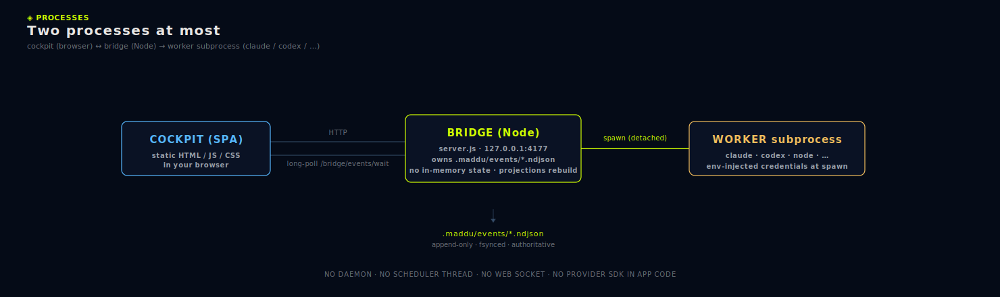
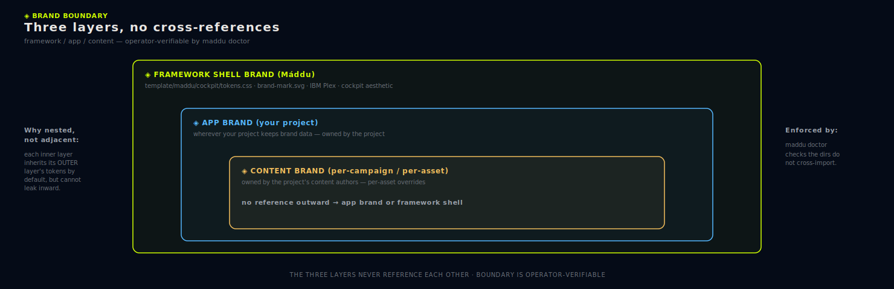

# Architecture

A deep dive for operators who want to understand how Máddu fits together. The user-facing docs ([01-getting-started.md](01-getting-started.md) through [13-troubleshooting.md](13-troubleshooting.md)) cover the surface; this page covers the substrate.

## Two-process model

Máddu runs as two processes at the most:

<a href="images/two-process-architecture.svg"><picture></picture></a>

- **Bridge** — a single Node HTTP server listening on `127.0.0.1:4177`. Owns the append-only spine, all projections, and the OAuth token store. Serves the cockpit as static files. No state lives in memory beyond a 1-second projection cache. Every restart rebuilds from disk. **One bridge, N repos:** if `~/.config/maddu/workspaces.json` lists multiple repos, the bridge mounts all of them simultaneously and routes each request to one via the `X-Maddu-Workspace` header. Each repo's spine remains its own source of truth.
- **Cockpit** — a vanilla-JS SPA in `maddu/cockpit/`. No framework, no build step. Talks only to the bridge. Long-polls `/bridge/events/wait` for live updates.
- **Workers** — short-lived subprocesses spawned by the bridge on demand. Each worker is one `claude exec`, `codex exec`, or custom Node process. Credentials are injected at spawn time and never serialized into the spine.

## Event flow

<a href="images/spine-and-event-flow.svg"><picture></picture></a>

The crucial property: **every write goes through the spine first**. Projections are downstream. If a projection looks wrong, blow it away — `project()` rebuilds it.

## File layout

```
<repo-root>/
├── maddu.json                       # framework version + content-hash manifest
├── maddu                            # ← v0.14+ POSIX wrapper (./maddu/run …)
├── maddu.cmd                        # ← v0.14+ Windows wrapper
├── maddu/                           # framework-owned (overwritten on upgrade)
│   ├── bin/maddu.mjs                # CLI entry (bundled v0.14+)
│   ├── commands/                    # CLI subcommand handlers (bundled v0.14+)
│   ├── run                          # POSIX shim (chmod 755)
│   ├── run.cmd                      # Windows shim
│   ├── version.json                 # bundled so the CLI can self-report
│   ├── runtime/
│   │   ├── server.js                # the bridge
│   │   └── lib/                     # spine, projections, hindsight, etc.
│   │                                # plus: workspaces (v0.13), global (v0.13),
│   │                                # session-active (v0.14), approvals (v0.15),
│   │                                # verify (v0.15)
│   ├── cockpit/
│   │   ├── index.html
│   │   ├── cockpit.js
│   │   └── cockpit.css
│   └── package.json
└── .maddu/                          # project state (never touched by upgrade)
    ├── events/
    │   └── 000000000001.ndjson      # the spine
    ├── state/                       # rebuildable projections
    │   ├── memory.ndjson
    │   └── *.json
    ├── lanes/
    │   ├── catalog.json
    │   ├── claims.json
    │   └── <lane>/mailbox.ndjson
    ├── skills/                      # SKILL.md files
    ├── mcp/                         # MCP descriptors
    ├── runtimes/                    # runtime descriptors
    ├── checkpoints/                 # git-backed snapshots
    ├── schedules/                   # NL→cron schedules
    ├── approvals/                   # approval ledger + policies
    ├── imports/                     # accepts + rejections logs
    ├── workers/                     # worker stdout/stderr captures
    ├── auth/                        # gitignored — OAuth tokens (also under ~/.config/maddu/auth/)
    ├── archive/                     # rotated slice-stop summaries
    ├── inbox/                       # operator inbox
    ├── briefs/                      # framework + project briefs
    ├── wiki/                        # framework + project wiki
    └── harness/                     # Node-only harness scripts
```

## Subprocess workers

When the bridge spawns a worker via `POST /bridge/runtimes/<name>/spawn`:

1. Read the runtime descriptor from `.maddu/runtimes/<name>.json`.
2. Resolve credentials from the auth store (`~/.config/maddu/auth/<provider>.json`).
3. Append `WORKER_SPAWNED` to the spine with a deterministic `wkr_...` id.
4. `child_process.spawn(binary, [...defaultArgs, ...extraArgs], { cwd: repoRoot, env: enrichedEnv })`.
5. Pipe stdout/stderr into `.maddu/workers/<wkr_id>/{stdout,stderr}.log`.
6. Expect the worker to heartbeat at least every 15 s.
7. On exit, append `WORKER_EXITED` with `exitCode`.

If the worker stays silent past 15 s, `project()` reports it as `stuck` at read time — no event is needed for the read-side state to update. This is the "stuck-worker" UX with no scheduler involvement.

## Three-layer brand boundary

<a href="images/brand-boundary.svg"><picture></picture></a>

The three layers never reference each other. `maddu doctor` checks the directories do not cross-import.

**Why this matters:** prior systems (notably AionUi) leaked cockpit aesthetics into user-saved brand profiles. The boundary makes that impossible by construction.

## Why files-only

This is about **Máddu's own state** (the framework layer) — not a constraint on
the product you build with Máddu, which may use any datastore it needs. Every
operational property Máddu cares about *for its own orchestration state*
reduces to a property of files on disk:

| Want | How files give it |
|---|---|
| Auditability | `cat`, `grep`, `git diff`. No specialized tooling. |
| Backup | `cp -r .maddu/ /backup/`. Done. |
| Portability | `git clone`. Done. |
| Recovery | Delete the broken projection. The spine rebuilds it. |
| Sharing artifacts | Send a JSON file. Recipient runs `maddu import`. |
| Versioning state | git tracks state changes alongside code. |
| Multi-machine inspection | rsync the repo. No DB drivers. |

No database — relational or otherwise — gives this set of properties without specialized tooling. SQLite gives you a single file but no usable `git diff`. The spine + projections approach gives you both.

## Lane + session lifecycle

```
session register
    │
    ▼
session active
    │
    │  (heartbeat as often as needed)
    │
    ├─→  lane claim ────────────┐
    │                            │
    │   (do work)                │
    │                            │
    ├─→  slice-stop              │
    │       │                    │
    │       └→ hindsight extract │
    │                            │
    ├─→  lane release ←──────────┘
    │
    ▼
session close
```

Every transition is one event on the spine. Replay the events and you can reconstruct the entire history of every session, every claim, every slice.

## Bridge restart semantics

`maddu start` after an unclean shutdown is safe:

- Spine is append-only; a `kill -9` can leave at most a single **torn final line** (a write interrupted before the OS flushed it). That is detected — not auto-repaired — by `maddu spine verify` (see *Concurrency and durability* below).
- Projections rebuild on first read.
- Active sessions and claims remain in the spine; the bridge reads them on boot.
- A `FRAMEWORK_BOOTED` event is appended.

The only state that can be "lost" across a restart is an in-flight HTTP response. Clients that poll (long-poll, repeated GETs) recover automatically.

## Concurrency and durability

The spine is the one authoritative artifact (hard rule #2), so its append path has to survive two failure classes the lane model does **not** cover: two processes appending at the same instant, and a crash mid-write.

**Who writes.** There is a real concurrent-writer path. The long-lived **bridge** (`runtime/server.js`) and any short-lived **CLI** invocation (`maddu slice-stop`, `maddu doctor`, a scheduled trigger) both call `spine.append()` against the same current segment. Máddu deliberately has no mutex — *lane claims coordinate agents, not spine bytes*.

**The lock is the OS.** `append()` opens the segment with flag `'a'` (`O_APPEND`). An `O_APPEND` write is positioned at end-of-file and is **atomic** for sizes under `PIPE_BUF` (4096 bytes on Linux; Windows `FILE_APPEND_DATA` is likewise atomic for appends). A serialized event line is virtually always under that, so two concurrent appends never interleave bytes — they serialize into two whole lines. The flag is passed explicitly in `append()` so this guarantee can't be silently lost by a later switch to a positional write. A **framing invariant** backs it up: exactly one event per physical line. `JSON.stringify` escapes any embedded newline to `\n`, and `append()` asserts the serialized line contains no raw `LF` before writing — so the one-event-per-line property the verifier depends on is absolute. (The only residual risk is an event serialized larger than `PIPE_BUF` racing another writer; in practice events are well under it, and the torn-line check below catches any interleave that did occur.)

**Durability is deliberately best-effort.** `append()` does **not** `fsync` per write — the spine *is* the WAL (see *What's deliberately absent*), and forcing a disk flush on every event would trade the framework's whole-machine throughput for a guarantee the verifier already provides at read time. A crash between `write()` and the OS flushing its buffers can therefore leave a **truncated final line**.

**Torn line ≠ interior corruption.** `maddu spine verify` distinguishes the two:

- `torn_trailing_line` — the last physical line of the last segment is unterminated (no trailing newline) and unparseable. This is the signature of an interrupted append: the event was *never durably committed*, and the operator can safely trim that one partial line. The verifier prints the remediation inline.
- `unparseable` — a bad line anywhere else means real mid-history data loss, a different and more serious condition.

Both are `FAIL`. The verifier is strictly read-only: it reports, it **never auto-repairs** (hard rule #2). The operator trims the torn trailer (or rolls back to a checkpoint for interior damage), then records a `slice-stop`.

## What's deliberately absent

- **No scheduler thread.** The 30 s schedule tick runs inline in the bridge loop. Schedules with sub-30 s precision are out of scope.
- **No worker queue.** Workers are spawned synchronously per request. Throughput is "one worker per spawn endpoint call."
- **No write-ahead log.** The spine is the WAL.
- **No mutex layer.** Lane claims are the coordination primitive; the bridge enforces them on append.
- **No web socket.** Long-poll over plain HTTP is enough.

## See also

- [hard-rules.md](hard-rules.md) — the invariants this architecture enforces.
- [05-bridge-endpoints.md](05-bridge-endpoints.md) — the API surface.
- [02-concepts.md](02-concepts.md) — concepts at a higher level.
- [charter.md](charter.md) — the mission, invariants, and canonical flow this architecture serves.
